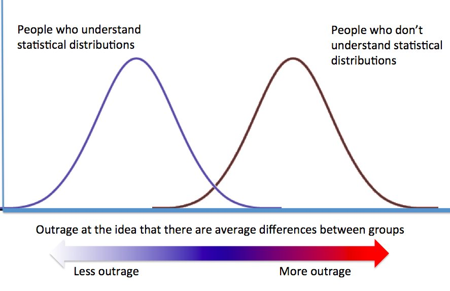
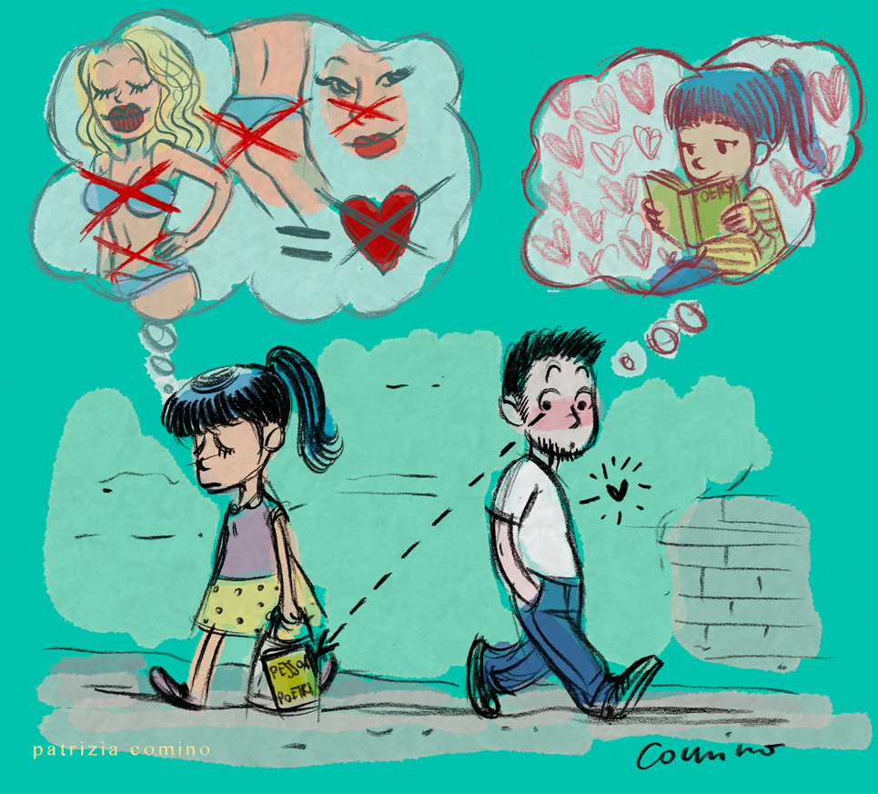
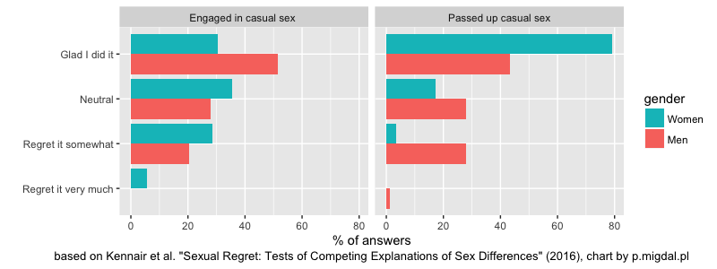
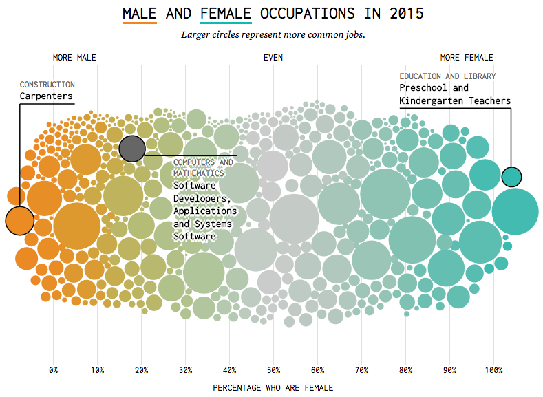
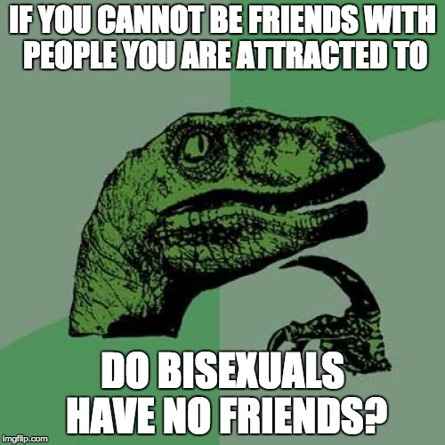
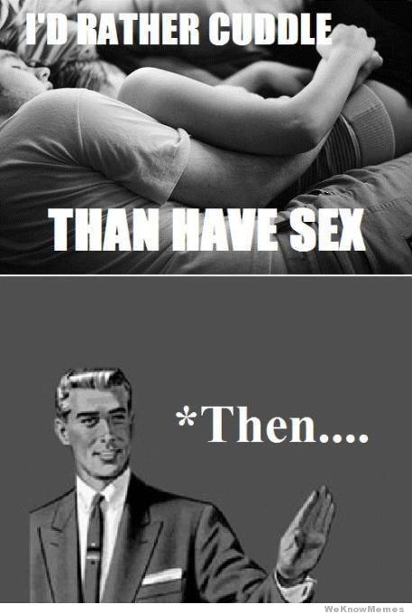

A typical metaphor for dating is a hunt, or a competitive game. It shouldn’t be! A much more fruitful metaphor is a collaborative project - you may bring different skills and have different priorities, but work on a common goal. Conversely, if you treat your dates as adversaries, they are likely to reciprocate the same way.

Hetero-dating is not a symmetric activity. Sure, `#notAllMen` and `#notAllWomen`, as for most traits variance within a group is much higher than the variance between groups[^averages].

> - talk: In conversation men try to impress their partners, women - get valuable social information.
> - MS: And Migdał does both.

Yet, for dating averages matter a lot, and change the overall dynamics. This part of dating for nerds series is focused on the differences between genders that may affect dating. For more context (and disclaimers) see [Dating for nerds (part 1): problem diagnosis](http://p.migdal.pl/2017/07/23/dating-for-nerds.html).

In most cases the differences are small (though, overblown by popular psychology):

- [The Cluster Structure of Genderspace](https://thingofthings.wordpress.com/2017/05/05/the-cluster-structure-of-genderspace/) Ozy Brennan, and quoted there:
- [Gender differences in sexuality: A meta-analysis](http://dx.doi.org/10.1037/0033-2909.114.1.29) by Mary Beth Oliver and Janet Shibley Hyde (1993), [pdf here](http://emilkirkegaard.dk/en/wp-content/uploads/Gender-differences-in-sexuality-A-meta-analysis.pdf).

Still, it is crucial to be aware of some of different motivations and preferences.

> - [A handy graphic for understanding outrage at statements about average differences between groups](https://twitter.com/sentientist/status/894959693822558209) by Diana S. Fleischman‏

## It is harder for boys than girls

You may get the impression that dating is harder boys than girls. Well, the data is unfortunately on your side, see:

- relationship status vs age from [Data Science of the Facebook World](http://blog.stephenwolfram.com/2013/04/data-science-of-the-facebook-world/) (2013),
- [Explaining Sex Rate Changes](http://www.overcomingbias.com/2019/03/explaining-sex-rate-changes.html) by Robin Hanson

It seems to be a direct consequence that women often date older men:

- [OK Cupid Data on Sex, Desirability, and Age](https://thesocietypages.org/socimages/2015/07/03/ok-cupid-data-on-sex-desirability-and-age/) by Lisa Wade
- [What’s the Deal With the Age Gap in Relationships?](https://theblog.okcupid.com/undressed-whats-the-deal-with-the-age-gap-in-relationships-3143a2ca5178) - Dale Markowitz at OKCupid blog

The good news is that while it sucks for men <25yo, the situation is way better afterwards. So, (a bit of) time is on your side! Too much time will make you interesting for archeology nerd girls.

Additionally, from my personal experience - women with age and experience have learned what they want and don’t want to do. It makes it easier for nerds, as there is more proactivity on the woman’s side, much less uncertainty, and fewer games (e.g. if she says she doesn’t want any sex before marriage she likely means that).

## Female perspective

First, for most your problems there are similar or analogous ones on women’s side - what gives you the idea that it’s easier for her to find someone with similar interests, or to overcome shyness?

Second, there is a lot of social pressure on the way she behaves. Some of this is related to the value placed on women’s modesty (i.e. _“she shouldn’t be too easy”_). But it seems that the largest burden is from (often unrealistic) expectations related to beauty standards. In the worst case, she may feel that her dating prospects are entirely dependent her looks.

- [It’s not only looks](http://66.media.tumblr.com/7050d427d3d58a7e0c6d86e4436ffb35/tumblr_oad6r4kAcr1sxo1gdo1_1280.jpg) by [Patrizia Comino](http://patriziacomino.tumblr.com/), posted with permission

To get a better view on dating from the female perspective, the best way is to have female friends that trust you enough to share their dreams and frustrations. It won’t solve your problems right away, but you’ll gain valuable insight. One friend advised reading fiction written by female authors.

Another interesting place is looking at good dating advice for women - e.g. [Matthew Hussey’s channel](https://www.youtube.com/channel/UC9HGzFGt7BLmWDqooUbWGBg); there is [Anna Szlęzak’s channel](https://www.youtube.com/channel/UCjTHgQe0B5m65Z7UY7cI6cw) (in Polish), from which I get a lot of inspiration. Usually there is less focus on getting any man, but more on getting a particular individual they are interested in. Other common concerns include [being ghosted](https://www.youtube.com/watch?v=U-ZMAgg2dPM) (this _“why doesn’t he call me”_), maintaining a relationship, and, well, filtering guys who are only interested in sex (even if they say otherwise).

## Safety

One crucial point, regardless of the type of relationship, is her safety. She has many legitimate concerns related to her safety:

- getting **pregnant** - all the health burden is on her, and most of the social one (even if you take the full responsibility, which she might doubt),
- contracting an **STI** - while it happens to men, for women the risk is higher - both of transmission and of consequences; also: they tend to be less reckless when it comes to their health,
- attracting a **stalker** or any other person who may attempt to maintain contact with her against her will,
- getting **raped** - by you, your drunk friend, some stranger on her way home; sadly, [roughly 15% of women fall victim](https://www.rainn.org/statistics/scope-problem).

What really helps is if you know her through a network of friends, and there are people she trusts that can vouch for you. When it comes to physical violence - [almost all men are stronger than almost all women](https://www.reddit.com/r/dataisbeautiful/comments/4vcxd0/almost_all_men_are_stronger_than_almost_all_women/) and women know that. Even if you never use force, they know that you could. Even if you know you would never hurt her, you must help her feel safe.

Popular culture harms us not only with unreasonable visions of romance (see [Disney Has Ruined Modern Romance](https://www.theodysseyonline.com/honest-look-modern-romance)), but it also spreads really bad examples:

- [7 Reasons So Many Guys Don’t Understand Sexual Consent](http://www.cracked.com/blog/how-men-are-trained-to-think-sexual-assault-no-big-deal/).

Make sure you respect her wishes (especially _noes_; with _yeses_ usually there is less friction) and that she can safely express them; and that you won’t try to circumvent it.

- [Tea Consent - animation](https://www.youtube.com/watch?v=oQbei5JGiT8)
- [Consent - a webstrip](http://www.ohjoysextoy.com/consent/)

In my experience, women didn’t have the slightest reservation with saying a firm _"no"_ if they were totally not interested (I am not particularly muscular or threatening looking; I never dated a girl when I was her superior, etc). At the same time, I only discovered afterwards that sometimes she said _"yes"_ because she was afraid of losing me. Things related to consent are not only related to physical safety, but also emotional safety. And fundamentally this isn’t a fixed checklist, but genuine care that your partner is having as enjoyable an experience as you.

When it comes to safety from sexually transmitted infections (and unintended pregnancy), it’s also your business. A great reading is found below:

- [Your Honest-to-God Guide to STDs](https://markmanson.net/std-guide) by Mark Manson

He presents a very reasonable summary of practices and risks of infection (both in terms of probability and severity of consequences). I would add that HCV is also worth getting tested for. In short:

> If you’re sexually active, get tested regularly. Have open conversations with your sexual partners about this stuff: “Have you been tested? Are you on birth control?” Yes, it’s awkward. But yes, it’s always worth it.

Importantly, while women are more concerned about safety on average, occasionally you will meet a woman less cautious than you. Even if it is her conscious choice to take risks (rather than a lack of knowledge, or impaired judgement due to alcohol or buzzing hormones), don’t lower your own standards! It’s better to pass on an otherwise good opportunity than to be dealing with its consequences for life.

## Confidence

Confidence seems to as important to male attractiveness as beauty to female. To an extent that their (perceived) deficit results in similar symptoms:

- [Nerdy Boys, Fat Girls, and Access to Sex](https://medium.com/@SexCoachSarah/nerdy-boys-fat-girls-and-access-to-sex-a4893f13a61a) by Sarah Martin

The entire book [Models: Attract Women Through Honesty](https://www.amazon.com/Models-Attract-Women-Through-Honesty-ebook/dp/B005EOTH24) by Mark Manson (my very favourite in the dating genre!) is pretty much centered on how to be confident and make this visible. The crucial point is about being non-needy. That is, being comfortable with who you are rather than relying too much on external validation.

If you are interested in a given woman, you shouldn’t be afraid to show it to her. A lot of behaviors considered creepy are centered around concealing sexual intentions. At the same time, if she turns you down you should be fine with that. Sure, it’s not what you dreamed of, but at the same time - being needy and having her decision affect your self-worth is unsexy.

The attractive part of confidence is not about being a jerk, who never admits to being wrong. It’s about calm and warm comfort. And it’s true not only for humans: [Think You Know What “Alpha Male” Means? These Wolves Will Prove You Wrong](https://www.rd.com/advice/relationships/alpha-male-wolves/).

## Casual sex

You may say that at least when it comes to sex it is easier for women:

> For men getting sex is a chore, for women getting sex is a choice

And in most cases, [getting any sex as a woman is trivial, compared to the effort required of a man](https://skeptics.stackexchange.com/questions/43508/are-men-more-likely-than-women-to-accept-an-offer-for-casual-sex). So, is it cool? Not necessarily. While for some men it may be that:

> Sex is like pizza - even when it is bad, it is still pretty good.

it’s rarely the case for women. Good sex requires safety, care and effort. (If you want to look at a single criterion - for a male it is usually easy to experience an orgasm during each intercourse; rarely is this the case for a female.)

And even if a woman is up for one-night stand, most likely she doesn’t want to be treated as an object. A man using her only as a means for his pleasure will rarely put effort into pleasing her. He may not even treat her as an individual, rather than a woman (which many women find off-putting, even at the subconscious level).

- Based on data from [Sexual Regret - Tests of Competing Explanations of Sex Differences](https://doi.org/10.1177/1474704916682903) by Leif Edward Ottesen Kennair, Mons Bendixen, David M. Buss in Evolutionary Psychology (2016)

Additionally, if there are many eyes looking at a bar, or many Tinder messages, it is harder to find genuinely interested guys (who may be shy) among the crowd of false-positives who spam her. If she is interested in a _one life stand_, it gets even trickier.

There is a stereotype that women do not like sex, and use it as a bargaining chip- e.g. to maintain a relationship. Well, from my experience, most women love great sex, and are enthralled by its vision. The key things are:

- great not any,
- usually it’s in the context (excitement, foreplay), rather than solely penetration,
- having a connection with her (it can mean very different thing for different individuals),
- feeling desire for her (vs wanting to release sexual tension with any woman),
- having pleasure with her, not using her to have pleasure.

Some general hints are here:

- [18 signs you’re having sex with a decent person](http://metro.co.uk/2017/06/17/18-signs-youre-having-sex-with-a-decent-person-6715364/) by Ellen Scott

## Gender ratios

Many places in which we spend our time have an uneven gender ratio - be it workplaces, departments at a university, special interest groups, anything. It can happen for various reasons - from the founder’s effect through different interests (especially on the line [things vs people](http://slatestarcodex.com/2017/08/07/contra-grant-on-exaggerated-differences/)) to outright discrimination.

You are likely to spend time in places with a gender imbalance in (questionable) favor of your gender. See [Most Female and Male Occupations Since 1950](http://flowingdata.com/2017/09/11/most-female-and-male-occupations-since-1950/) by Nathan Yay:

It also happens the other way - many liberal arts and humanities departments lack men. One of my friends complained about a party she attended:

> Adrianna: the only heterosexual male was the host’s cat

If you are confined within such environments even small deviations from an even ratio change the dating dynamics [Dating Scene from The Difference Between Living in New York and San Francisco](http://thecooperreview.com/difference-between-living-in-new-york-and-san-francisco/). The supply and demand mechanics can lead to serious effects [Sex and the single black woman - The Economist](http://www.economist.com/node/15867956).

See also:

- [The New, Interactive Singles Map](http://jonathansoma.com/singles/) by Jonathan Soma, and:
  - [The SF Bay Area, where the streets are paved with single young men](http://visualizing.nyc/bay-area-zip-codes-singles-map/)
  - [Ladies, there are men in NYC! (but not where you’re looking](http://visualizing.nyc/nyc-zip-codes-singles-map/)

More skewed environments may make it almost impossible to date. But there is one more subtle yet important thing - heavily masculinized places may result in a culture that’s not optimal for women.

- [The odds are good - PhDcomics](http://phdcomics.com/comics/archive.php?comicid=8)

Additionally, in such men-abundant environments it can be harder to get involved with any of those men, see:

- [Paradox of Choice](https://www.ted.com/talks/barry_schwartz_on_the_paradox_of_choice) - a TED talk by Barry Schwartz

Also - you won’t learn how to interact with women. In male-dominated environments, a few women may be not representative of their gender, and furthermore - may be altering their behaviour to fit the environment.

## Females are more choosy

> There is no Valley of the Dolls.
> There is no party you can walk into where strange women will just throw themselves on you. - [Nonmonogamy for Men: The Big Picture](https://freaksexual.com/2009/11/05/nonmonogamy-for-men-the-big-picture)

We are not some ideal creation. We are a byproduct of evolution. A strain of medium-size tree-climbing mammals, who just recently started moving on two legs, and went bald. Understanding our drives and instincts (both ones we want to act upon and ones we really want to inhibit) is crucial.

Of course, there are many problems with differences being reinforced by culture (via social norms, religion, adverts, etc) which tends to reinforce stereotypes often leaving nerds of both genders in a no man’s land (no pun intended!).

Moreover, in practice it won’t matter if a given gender role expectation is based on biology, upbringing, or current social norms (and any systems biologist will tell you that it is impossible to make a clear-cut divide between these). This blog post is about your personal actions, rather than delving into an ideal society.

Because while the average number of children by men and women is the same (it has to be), the variance isn’t. It promotes a lot of risk-taking activity in men, both their boon and doom (and the rest of society’s), see:

- [Is There Anything Good About Men?](http://www.denisdutton.com/baumeister.htm) by Roy F. Baumeister

It happens also at a very physiological level, see:

- [Milk composition differs based on a baby’s sex and a mother’s wealth](https://www.scientificamerican.com/article/boys-and-girls-may-get-different-breast-milk/) by Marissa Fessenden at Scientific American

With respect to risk-taking, testosterone changes a lot:

- [Testosterone-fuelled traders make higher profits](http://blogs.discovermagazine.com/notrocketscience/2008/04/14/testosterone-fuelled-traders-make-higher-profits/) by Ed Yong (very likely giving rise to [Why Do So Many Incompetent Men Become Leaders?](https://hbr.org/2013/08/why-do-so-many-incompetent-men) by Tomas Chamorro-Premuzic).

E.g. males in their 20s are almost 4x more likely to die than females, mostly due to accidents. See [mortality in Poland in 1950 and 2013, by age and gender](https://plot.ly/~PiotrMigdal/33/mortality-in-poland-in-1950-and-2013-by-age-and-gender/) by me. To get a more fine-grained analysis, [this chart shows how you will probably die, and it’s changed a lot in 100 years](http://www.brisbanetimes.com.au/national/health/this-chart-shows-how-you-will-probably-die-and-its-changed-a-lot-in-100-years-20160509-gopmgh.html) by Inga Ting.

There are plenty of men interested in having one partner for life, and women interested in casual sex. Yet, there is an imbalance (otherwise we would have 1:1 ratio of male and female sex workers). Why? Homo sapiens females are likely to be more choosy when it comes to selecting their partners. You don’t need to dig too deep to learn about these phenomena, just see these Wikipedia pages: [Mate choice](https://en.wikipedia.org/wiki/Mate_choice), [Parental investment: Sexual selection](https://en.wikipedia.org/wiki/Parental_investment#Sexual_selection) and [Bateman’s principle](https://en.wikipedia.org/wiki/Bateman%27s_principle). Another way of saying this is that women (on average) have higher standards. One practical remark is that:

- [Men Are More Likely to Be Sexually Attracted to Their Opposite-Sex Friends](http://nymag.com/scienceofus/2016/10/men-are-more-likely-to-be-sexually-attracted-to-friends.html) by Drake Baer

So yes, there is some asymmetry to deal with. This is the balance of valuing friendship and support vs sexual gratification. No matter the closeness of your friendship, it doesn’t imply any sexual interest on her side (the friendzone deserves a separate chapter). Though, it is easy to see how one could arrive at this interpretation:

- [Yes Virginia, they all want to bang you - Ladder Theory](http://www.laddertheory.com/yesvirginia.htm) (NOT an endorsement)

Beware - places dominated by frustrated, cynical men are rarely good places for healthy growth. While these 3 points are essentially correct, the conclusions are harmful. If you are interested in women only for sex, I guarantee that you will have a shallow and unfulfilling life. Vide [The Infernal Inner Lives of Incels](https://www.playboy.com/read/the-infernal-inner-lives-of-incels-1).

The traditional ways to deal with that is to say that (hetero)men and women cannot be friends. What’s the problem with having friends you find attractive? (Hint: no, you don’t need to hit on everyone you find attractive.)

> Spoiler: bi folks (and even pansexuals) are not attracted to everyone.

## For the skeptical

If you firmly believe we are blank slates, and the only innate difference between the sexes is body shape, take a look at this thread:

- [Trans people of Reddit, what was something you weren’t expecting to be told, find out, or experience when going through your transition?](https://www.reddit.com/r/AskReddit/comments/4g1pgu/serious_trans_people_of_reddit_what_was_something/)

Also, bisexual women often shine some light how these differences manifest in dating:

- [What I Hate About Dating Women vs What I Hate About Dating Men](https://medium.com/@emmalindsay/what-i-hate-about-dating-women-vs-what-i-hate-about-dating-men-bb2699ba182b) by Emma Lindsay

## Taking initiative

In many social contexts, it is expected that a man is going to take initiative (ask out, ask to kiss, etc). Even if she is interested, she may expect you to move things forward. If you don’t, she may assume that you are not interested in her at all. It is a pretty strong gender difference, and if you miss this one - well, you will pass on most the women interested in you. (No, life is not a romantic comedy, in which it’s often the girl who asks the cute-but-shy boy out.)

- [Cupid on Trial: A 4-month Online Dating Experiment Using 10 Fictional Singletons](http://jonmillward.com/blog/attraction-dating/cupid-on-trial-a-4-month-online-dating-experiment/)
- [Men on Tinder Explain Why They Swipe Right on Literally Everyone](https://broadly.vice.com/en_us/article/men-who-swipe-right-to-everyone-on-tinder-explain-themselves) by Sirin Kale or [How Tinder “Feedback Loop” Forces Men and Women into Extreme Strategies](https://www.technologyreview.com/s/601909/how-tinder-feedback-loop-forces-men-and-women-into-extreme-strategies/)
- [Tinder Experiments II: Guys, unless you are really hot you are probably better off not wasting your time on Tinder — a quantitative socio-economic study](https://medium.com/@worstonlinedater/tinder-experiments-ii-guys-unless-you-are-really-hot-you-are-probably-better-off-not-wasting-your-2ddf370a6e9a)

It has happened to me that a woman asked me out, asked for a kiss, or asked for sexual activity. It was awesome and I appreciated it a lot.

Often when I ask female friends how they move things forward they say that it always happens naturally, with no effort needed. Yet, having organized a bunch of conferences, I know that if things flow seamlessly, someone else is putting in a lot of effort in making it seem so.

For example, quite a few years ago I naively thought that with a friend, who is an outspoken feminist, it would work differently. I was waiting for 1:1 reciprocity when making the first moves. So, after making some moves from my side, I waited for her steps. And… things didn’t progress. A week later, I talked with her closest friend in a party. He was a bit drunk, and in the oversharing mode told me what she had told about the meeting:

> MA: Oh, intellectuals. It’s wonderful to talk with them, but when it’s time to make a move, they are clueless.

Then I read the (in)famous [The Game: Penetrating the Secret Society of Pickup Artists](https://en.wikipedia.org/wiki/The_Game:_Penetrating_the_Secret_Society_of_Pickup_Artists) by Neil Strauss. It made a day & night difference as I had lacked the key skills of taking the lead in asking and initiating touch. Sure, some techniques are impersonal or manipulative, and I have matured in the meantime (and I never had an interest in picking up hot chicks in bars). (See also: [What Men REALLY Think Of Women](http://www.yourtango.com/2016297843/what-pick-up-artist-instructor-can-teach-women-about-men) by Ossiana Tepfenhart.) Though, as [Mystery’s and Style’s Kiss Close Routines](http://www.thepickupdiary.com/mystery%E2%80%99s-and-style%E2%80%99s-kiss-close-routines/) say,

> Your job is to kiss her.

For many nerdy men this “taking initiative” looks particularly challenging, because of:

- the lack of typical “male” confidence,
- not knowing how to approach (given social norms, situational context),
- not discerning sexual interest from platonic friendship and vice versa (social cue blindness),
- responsive desire (e.g. many women are aroused only in some context).

Why does it happen? Except, of course, for cultural expectations (which may be very high).

- [Spontaneous vs responsive desire](http://www.thedirtynormal.com/blog/2014/06/16/i-drew-this-graph-about-sexual-desire-and-i-think-it-might-change-your-life/) by Emily Nagoski
- [6 Reasons She’s Not Initiating Sex](http://www.elephantjournal.com/2014/11/6-reasons-shes-not-initiating-sex-adult/) by Lucy Animus

Yet, well, it is how it works. Even if it is your least favorite part, it is worth it (at the same time complaining that things should work differently won’t help you at all). There is a silver lining - [it is advantageous to make the first contact](https://theblog.okcupid.com/a-womans-advantage-82d5074dde2d). How to ask out will go in the next episode.

> Sex - those who know grammar will get it

## Toxic masculinity

A lot of pressure goes into men not showing emotions that may reveal their weaknesses, with the biggest emphasis on not crying (with the sole exception of the death of immediate family members).

> Men won’t tell me how they feel because they are taught to be ashamed of their feelings (and, by the way, lust is a feeling.) - [Emma Lindsay](https://medium.com/@emmalindsay/why-does-dating-men-make-me-feel-like-shit-12c25e539021)

Additionally, in the Western culture male touch is often restricted to sexuality, see:

- [How a Lack of Touch is Destroying Men](http://upliftconnect.com/how-lack-touch-destroying-men/) by Mark Greene

Another common socialization is pressure to perform (at work, in bed, everywhere). All of these phenomena may contribute to the fact that in almost all countries men take their own lives by a much higher margin than do women (by a factor of 5x).

- [Infographics: male suicide in the UK](https://mosaicscience.com/extra/infographics-male-suicide-uk) by Will Storr and Paulo Estriga

There is a widespread mindset of competition among men, ideally centered around objective measures like numbers (salary, number of sex partners etc) and avoiding subjective measures of fulfillment. There is a proverbial example:

- [Perceived Average and Ideal Penis Size](https://www.dred.com/uk/does-size-matter/) (yes, most men think their own device is too short)

Don’t fall into that trap, as it is unlikely to make you happier. At the same time, especially when it comes to your sex life, you will compare yourself against unreasonable exaggerations and brags.

> Writing about sex makes me feel like I’m either humble-bragging or pandering. There’s no in-between. - [Why We (Men) Don’t Write About Our Sex Lives](http://verysmartbrothas.com/why-we-men-dont-write-about-our-sex-lives/) by Damon Young

Why does it matter (for dating, not only - well-being or making society better)? The key thing is to be open to experiences. Treating every _“I didn’t have sex”_ as a failure is going to result in a lot of frustration, often for no good reason. Maybe you had a wonderful conversation or some blissful cuddling. Don’t ruin it by setting your goals too narrow. Appreciate the time with her, and don’t turn dating into an array of checkboxes or a score count. Even worse, if you are driven to have sex mostly to score, it won’t be respectful of her:

- [Two simple things I wish someone told me as a teenage boy - a webstrip](http://thewireless.co.nz/articles/the-pencilsword-no-i-in-sex)

## Individual

At last, not least - with all that said above, you will be dating a particular girl, not an average girl (or in the worst case: _“an abstract concept of a girl”_). Sure, for your very initial educated guesses it is beneficial to know in which areas she is likely to have different preferences or priorities. Perhaps the most important thing is that she is likely to have more broad (and less focused) needs and interests.

But in the process of getting know her better and better, sticking to the gender average will make less and less sense. And if you wish to know something, just ask them. :)

## Extra links (added later)

- [Turn-ons by gender chart](https://twitter.com/dalequark/status/854539323496116224) (with a clear dominance-submission gender split) by Dale Markowitz
- [The Words Men and Women Use When They Write About Love](https://www.nytimes.com/interactive/2017/11/07/upshot/modern-love-what-we-write-when-we-write-about-love.html) - an interactive exploration
- Clarisse Thorn, [Confessions of a Pickup Artist Chaser](https://www.amazon.com/Confessions-Pickup-Artist-Chaser-Interviews-ebook/dp/B007I5HRQU) - a book dissecting dating, written by a nerdy, sex-positive feminist
- [Why Do We Demonize Men Who Are Honest About Their Sexual Desires?](https://goodmenproject.com/sex-relationships/why-do-we-demonize-men-who-are-honest-about-their-sexual-needs/) and [Why Are Men Expected to Make the First Move?](https://goodmenproject.com/featured-content/why-are-men-expected-to-make-the-first-move-in-sex-and-relationships/) by her
- [Why Don't Women Ask Men Out on First Dates?](https://www.psychologytoday.com/us/blog/the-how-and-why-sex-differences/201104/why-dont-women-ask-men-out-first-dates) by Michael Mills in Psychology Today

## Closing remarks

I am really grateful to [Sarah Martin](https://sexcoachsarah.com/) for all inspiring conversations. This post also benefited from remarks by [Maria Łepkowska](https://www.instagram.com/malpanka/) and [Michał Kaftanowicz](http://kaftanowicz.com/).

I know I promised to write about social skills first. Yet, it has proved to be a way more challenging topic than gender differences. The next one will be either

- _social skills for aspies_ or
- nice guys, friend zone and rejections.

[^averages]: You spend your evenings with people, not - averages. Unless you are a stats nerd.
