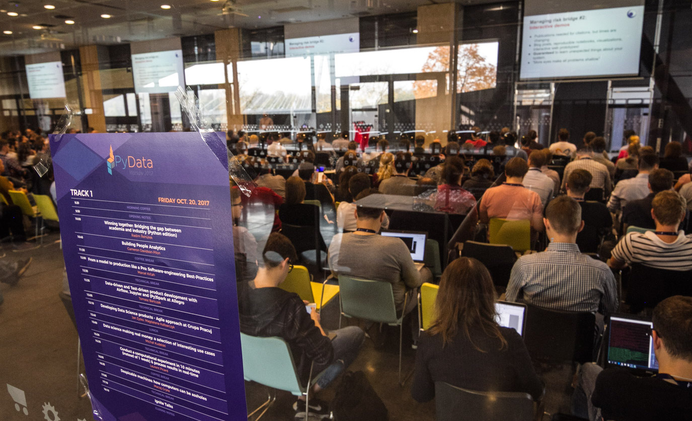
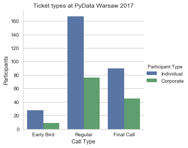
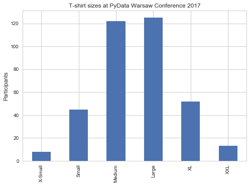
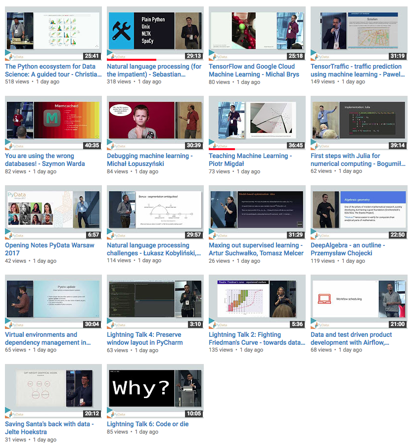

[PyData Warsaw 2017](https://pydata.org/warsaw2017/) took place on 19-20 October 2017 at the Copernicus Science Centre. This conference was heavily focused on machine learning and deep learning.

If you are interested in the talks, here they are:

- [all recordings](https://www.youtube.com/playlist?list=PLGVZCDnMOq0oe0eD-edj_2CuBIZ938bWT) (with slides and speaker at once!)
- [some of the slide decks](https://github.com/lopusz/pydata-warsaw-2017)

During this conference a few new packages were announced: [RaRe-Technologies/bounter](https://github.com/RaRe-Technologies/bounter) (`Counter` that uses a limited amount of memory regardless of data size), [CamDavidsonPilon/lifestyles](https://github.com/CamDavidsonPilon/lifestyles) (conjoint analysis), [koaning/evol](https://github.com/koaning/evol) (map-reproduce for evolutionary algorithms).

## Ancient wisdom

> Herodotus, the Greek historian, reported that the ancient Persians tended to deliberate on important matters while they were drunk. They then reconsidered their decisions the following day when they were sober. If it happened that their first deliberation took place when they were sober, they would always reconsider the matter under the influence of wine. If a decision was approved both drunk and sober, the decision held; if not, the Persians set it aside. - [Big Decision? Consider It Both Drunk And Sober](https://www.forbes.com/sites/chunkamui/2016/03/22/wine-and-sleep-make-for-better-decisions/#96cdc2124b1f)

The initial idea to organize one took place at PyData Berlin 2016 ([my impressions from this event](http://p.migdal.pl/2016/05/25/my-impressions-from-pydata-berlin-2016.html)), while drinking beers at the conference site. Later, back in Warsaw, Piotr Szwed gathered organizers and step-by-step we started making it happen.

## Analytics

It was about data science. So how about digging data from this conference and sharing insightful (or not) results? Here they are! (Here is a [Jupyter Notebook generating these plots](https://github.com/stared/random_data_explorations/blob/master/201711_pydatawaw/analysis.ipynb), based on anonymized data.)

### Demographics

We had 415 participants and speakers from 68 cities from 19 countries.

Attendees came from the following **countries**: Poland, Germany, United Kingdom, Denmark, Netherlands, Spain, Sweden, United States, Ukraine, Czech Republic, Norway, Ireland, Italy, Romania, France, Israel, Portugal, Latvia and Switzerland.

From **Poland** the most represented **cities** were: Warsaw, Kraków, Poznań, Białystok and Wrocław. From **other countries** it was: London, Frederiksberg, Stockholm, Madrid, Oslo, Copenhagen, Prague, Dublin, Sibiu and Berlin.

While it was an international event by all means, 80% participants were from Poland and 44% from Warsaw. Sure, Warsaw is a vibrant city when it comes to its data science community and it attracts people from other countries. Yet, I am curious how to bring a more diverse audience. Higher ticket prices that are more manageable for Western Europeans sound like one possible solution, but I don't know if it is the best route.

### Sign up and check in times

This is a piece of information for prospective conference organizers.
After booking a venue and persuading sponsors that we will get many attendees, it is stressful to see only a handful of sign ups.
Don't worry - many people book things just before the deadline!

For more on this subject, see:

- Valentina Alfi, Giorgio Parisi & Luciano Pietronero, [Conference registration: how people react to a deadline](https://doi.org/10.1038/nphys761), Nature Physics 3, 746 (2007)
- Tomasz Durakiewicz, [A universal law of procrastination](https://doi.org/10.1063/PT.3.3064), Physics Today 69, 2, 11 (2016)

If you are curious about the ticket types, here they are:

Also, there is data for check ins (91% of those who signed up). Though, it comes with a disclaimer that some people may have come in earlier, and formally checked in later.

### T-Shirt

As any respectable conference, we had T-shirts. The sizes were:

My girlfriend wrote [Death to the Conference T-Shirt](https://medium.com/@SexCoachSarah/death-to-the-conference-t-shirt-2438b24589d0). Yet, she liked this one. The top tip is to select a T-shirt in the correct size for you, and when in doubt, aim for a smaller size. Plus, in this case they were nice and clean, with a beautiful conference logo designed by Magdalena Grodzińska.

## Thanks

I really liked the conference. Yeah, I know - I'm biased as an co-organizer. (Though, all heavy work wasn't done by me. I had the pleasant task of inviting the speakers.)

The biggest thanks is for all speakers - it is them who make a conference a great and inspiring experience. We had wonderful **keynote speakers**:

- [Jarek Kuśmierek](https://www.linkedin.com/in/jaros%C5%82aw-ku%C5%9Bmierek-73322598/) (Senior Engineering Manager at Google Poland)
- [Radim Řehůřek](https://twitter.com/radimrehurek) (creator of [Gensim - topic modelling for humans](https://radimrehurek.com/gensim/))
- [Katharine Jarmul](https://twitter.com/kjam) (author of [Data Wrangling with Python](http://shop.oreilly.com/product/0636920032861.do) book)
- [Cameron Davidson-Pilon](https://github.com/CamDavidsonPilon) (author of [Bayesian Methods for Hackers](http://camdavidsonpilon.github.io/Probabilistic-Programming-and-Bayesian-Methods-for-Hackers/) book and lifelines package)

Special thanks to the **program committee**: Dominik Batorski, Michalina Boguszewska, Łukasz Czarnecki, Maciej Jaśkowski, Rafał Małanij (co-chair), Piotr Migdał, Mateusz Opala, Piotr Szwed (co-chair) and the **organizing committee**: Filip Danieluk, Klaudia Gębala, Marta Krysa, Marianna Krzewińska, Rafał Małanij, Małgorzata Parfieniuk, Sujatha Ramshanker.

## Talks, once again :)

