I really enjoy visiting [r/dataisbeautiful](https://www.reddit.com/r/dataisbeautiful). Yesterday, I saw a post about visualizing Tinder matches for AI-generated faces:

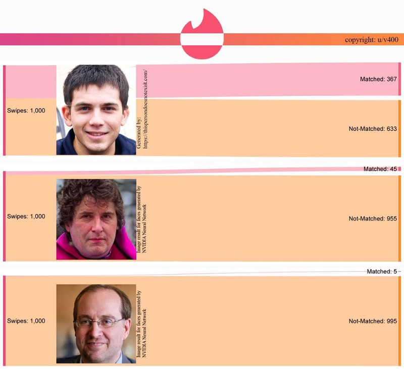

I was curious if there is more online dating vis, so I searched for original content posts [mentioning Tinder](https://www.reddit.com/r/dataisbeautiful/search?q=tinder&restrict_sr=1&sort=top)… And I didn’t expect the abundance of [Sankey diagrams](https://en.wikipedia.org/wiki/Sankey_diagram)! Almost all of them used [an online Sankey diagram builder by SankeyMATIC](http://sankeymatic.com/build/) (D3.js, obviously). These flow diagrams caught my eye… and make me curious on:

- How do people categorize interactions?
- How many matches or initial conversations turn into positive, meaningful interactions?
- What is their goal? Relationships? Sex? Anything else?

As a small disclaimer — it is pure anecdata, not a demographic study. It is a collection of data-driven stories. Unless marked otherwise, I use the authors’ quotations (many are excerpts from much longer descriptions or conversations). Personally, I didn’t use Tinder that much (as I prefer emails to chats and intellectual conversations to first impressions; [I bemoan that OKCupid got tinderified](https://news.ycombinator.com/item?id=18739618)), yet — it was interesting to follow these stories.

### Here are the diagrams

#### 117 Days On Tinder

> Male, 22. Straight. A Canadian city with a metropolitan population of around 1 million.

> Nearly 4 months ago — after my relationship of 3 years ended — I decided to create a Tinder profile.

> I’m probably a fairly normal looking person, maybe a bit above average but certainly no model. The pictures currently on my Tinder profile have [Photofeeler](https://www.photofeeler.com/) attractive scores ranging from 7.7 to 9.3.

See [117 Days Of My Tinder Profile In Data](https://towardsdatascience.com/117-days-of-tinder-in-data-755fe9ed853e) write-up and data analysis by [Brayden Gerrard](https://medium.com/u/5ada614bb9d4).

#### My 86 Days on Tinder

Some went longer in their methodology:

> I spend like 10 minutes, tops. Longer only if there’s active chat during my commute time and even then cut it off with “arrived at X, gotta go chat later!” when the chat seems to be leading to a lull. Swipe recent additions by looks alone, text any new matches who have good profiles, text existing matches with whom I’m making plans. Chat only briefly to establish potential for rapport before suggesting a casual public meetup.

> Looks: A cross between Jon Hamm and Edward Norton but with dirty blond hair. Not terribly fit but not obviously paunchy. Photos are: with friends at a drinks lounge, standing tall on a mountain summit, suit and beard with a special drink at a unique theme event party, at the tiller while sailing, holding my young daughter (face cropped out), and a silly photo in tracksuit making a grin with a fruit rind for teeth.

> Technique: No unsolicited dick pics, comment about something in her photos, ask her to talk about her interests or hobbies, remember (or scrollback check) what she said in later chats. Send helpful information like restaurant recommendations or events relevant to her interests without requesting anything in return or suggesting I tag along.

> Profile: Age, professional title, where I’m from, where I’ve lived, where I’m based, common travel destinations. Suggest becoming friends for activities I like. Height. Joking FAQ about typical stereotypes regarding my origins and interests in a mix of languages in which I’m conversant. Unchanged except for one correcting a grammar mistake as suggested by one of the no-spark meetups.

> NS = sex on first meeting (typical Tinder hookup as advertised)  
> Multiple NS = Multiple-night stand (had sex a few times but inconsistently)  
> FWB = Friends With Benefits (consistent sex without commitment)  
> GF = Girlfriend (commitment)

#### Another guy

> Yes, that’s 100% true, I generally don’t rely on tinder for my female contact, it’s more something I use for fun, as do most of my peers. Only when a girl seems really cool I meet up, hence the low meet-up rate. But I feel like the female comparison provided used tinder in the same way so I thought this would make a good comparison.

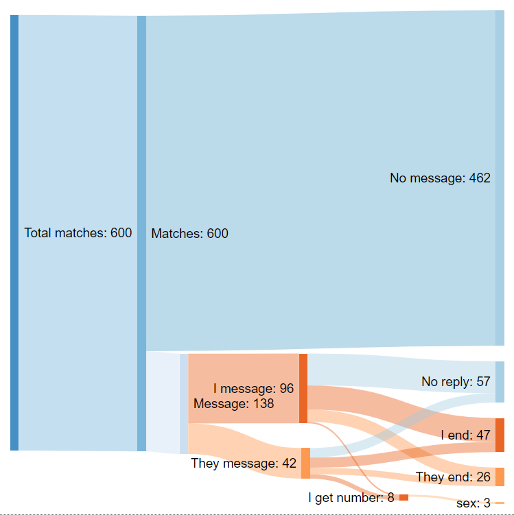

#### An opening gambit: The success of my standardised opening message on Tinder

> 20 something straight male in small UK city

> “Either you have really pretty eyes or you’ve got your filter game on point”

#### A woman from Australia

> I made this after seeing various similar representations from a male point of view, and after talking to my male friends who also use tinder. They were shocked by the volumes of matches on my profile etc.

> I just went through each message and made a tally of each path. Took a fair while, there is probably an easier way.

> Combined cities, about two months of ‘use’ but there was a large gap where I didn’t have the app on my phone.

> city 1 approx three weeks  
> city 2 a bit over a month  
> both infrequent use over the period.

> I split the two cities because I was originally going to also split the outcomes, but it was getting too messy. They are two cities in Australia, city 1 I visited for a few months, city 2 is my home city.  
> I also changed my profile between the two.

> I was actually fairly picky, but most the ones I selected I got a match with.

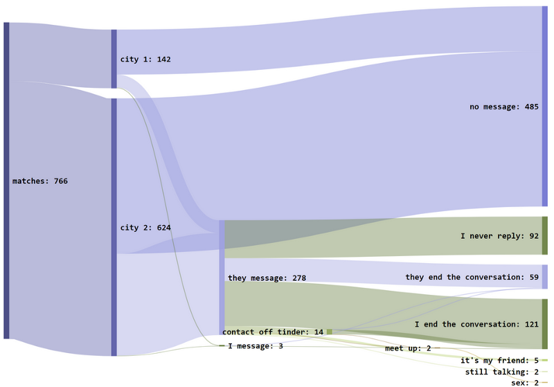

#### A gay man from Sao Paulo

> I live in Sao Paulo — Brazil and I’am a gay man, mid 20s. I’m kinda good looking, 7,5/10 BUT I’m funny! :)

> I have a few rules:

> No more than 5 matches a day (sometimes I’m bored so just go swiping).

> Try to start talking with at least 2 guys every day. (clearly, I don’t follow it a lot, but I try).

> ALWAYS answer when someone starts talking to me, I know how hard it is to take the courage to do it and being ignored is really sad.

> I don’t date closeted guys.

> I’m really happy that my new BF started talking :P

\*fixed some obvious typos, for readability

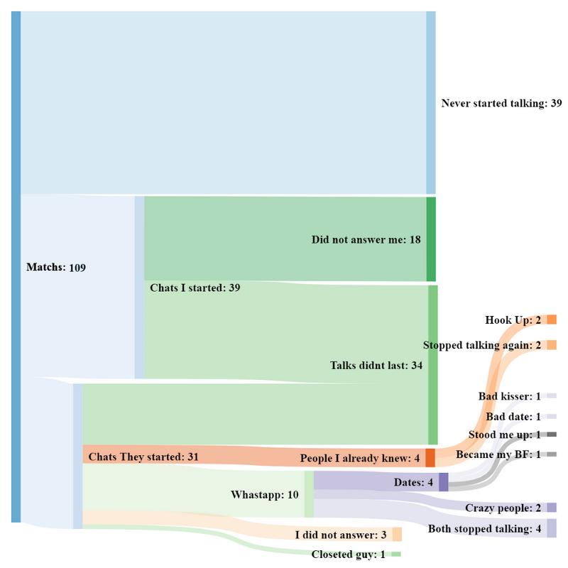

#### My 2017 of successful Tinder unicorn dating

> 30 years old, Female, Pansexual, Live in a large city in Latin America, Single

> Most people agree that I’m a “solid 7” in terms of attractiveness, and that “you turn into a 9 when you start talking”. Except my siblings, who agree on the “solid 7” part but say that “when you start talking you actually turn into a 5. Scratch that, make it a 3”.

> I don’t really understand how race works, but I’ve been called everything from “white” to “white latina” to the just weird “tan enough that you’re exotic but not dark enough that you’re scary” which yes, is a turn-off.

> **About my profile:**

> It’s in english even though I live in a non-english speaking country

> Photos are: two of my face (frontal, no tumblr angle), one full body on a plastic elephant holding a dog.

> I don’t specify my sexual orientation, that I prefer hookups, or that I prefer couples

> My name, age and distance are real and on display

> My Instagram is connected. My handle is my full name

> I call dibs on not writing first

> **What I look for:**

> Ages between 26 and 42, both male and female.

> I favour tourists and passer-by’s

> I prefer hooking up with couples, so I favour people who specify “poly” or “open relationship”

> I only swipe if I’m 100% interested in hooking up, so I rarely swipe right. Almost all my right swipes end up in matches.

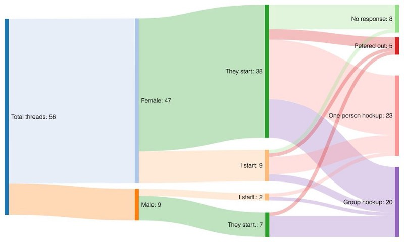

> \[Unicorn is\] a bisexual or pansexual person who is willing to join a couple for a sexual encounter.

#### My 28 Days on Tinder

> My area is a Metropolitan city (UPG) in Indonesia where Tinder is not really popular at all.

> The first 30 match happened in 3 days.

> I’m a straight male at mid 20 with postgraduate degree.

> The canned first message isn’t tailored at all (ball rolled opening) since 80% of woman’s profile don’t put any description on their online profile.

> After 3–4 message, I immediately ask for WhatsApp number to filter out the one who has interest level below 5.

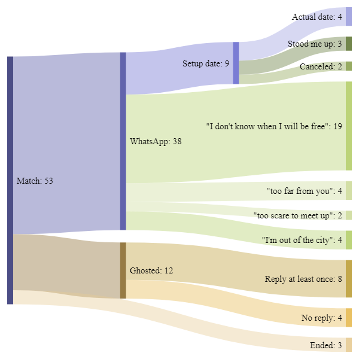

#### 24 hours on Tinder as a Female & first messages

> I wanted to mainly focus on the content of the first message, as a lot of them tend to say basically the same thing. For example I mention Rocket League in my profile and almost all the “Comment on my Profile” messages were about it, lol.

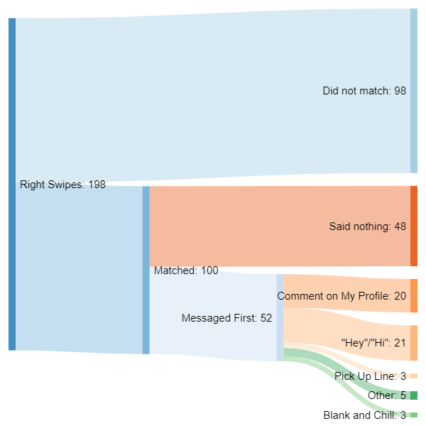

#### And one is Excel

> My three weeks on Tinder in Russia during this year’s FIFA World Cup

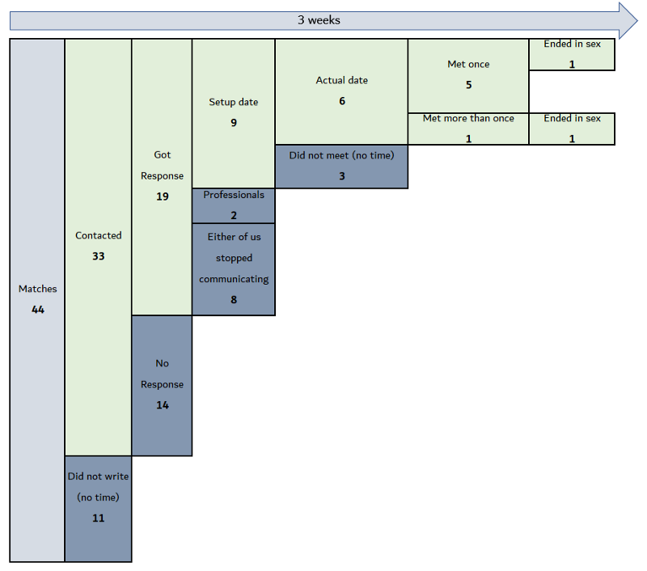

Well, while it may not as visually pleasing as a D3.js Sankey diagram, it’s up to the point.

### Not only Tinder

Tinder is a popular service, but not the only one. If you need a quick guide, there is no better summary than [You’re Really Saying With Your Dating App by CollegeHumor](http://www.collegehumor.com/post/6948732/what-youre-really-saying-with-your-dating-app).

#### My Dating Success over 7 Months (Tinder, Bumble, & Real Life)

> Dating is a numbers game, the more you swipe, the more matches you’ll have.

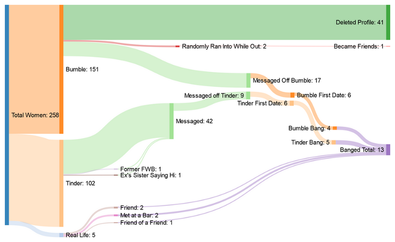

It got an extended comment by another user:

> Yeah, I assume bang means sex here. In which case this is more of a “Sex was accomplished” data set. But there is no indication of “dating” or “success”: number of dates, your actual interest in the match as a future dating partner, their interest in you as a dating partner, length of dating period, etc. It’s interesting to me that you clarify a group of FWB, but not a group of “persons I continue to have a romantic interest in”. That seems counter-intuitive to an actual study on dating success. (This is, of course, based upon the assumption that dating success is an ongoing romantic relationship.)

> If this is actually intended to be more of a “Sex was accomplished” data set, it would interesting to gather more data. Number of dates or meetings prior to sex, repeat sexual encounters, your satisfaction with the experience, their satisfaction with the experience, change in those satisfaction levels over repeat encounters, and enjoyment or difficulty during non-sexual parts of the encounters.

#### How I met my boyfriend — 6 months of dating in 2016

> I am a woman who mainly dates men. The method I used was a little weird. For OKC (Okcupid) I used the mode where no one could see me unless I’d starred them (I think it was called incognito mode back then), which meant I didn’t get any messages from anyone I hadn’t matched with. I almost always messaged everyone I matched with first.

> I tried not to match with too many people per day so I could give each conversation some decent attention. And I didn’t match further if I already had dates planned. I used a Trello board with a Kanban plugin to manage this (yeah this is a little weird too). Here is part of it, hilariously that stale card in “date planned” is the guy that turned into my boyfriend [https://imgur.com/a/bYnTZ](https://imgur.com/a/bYnTZ)

> My goal was always to get to a date because I felt like I couldn’t gauge if I really liked people online?

> I manually entered the data into a spreadsheet as I dated.

> Also no, real life is not an app :) It was people I met IRL.

> **I ended up meeting my BF on Tinder.** We actually didn’t have a very good conversation on Tinder haha but our first date was great. Also his pictures were bad. I always tell other women that. If they are dating straight men, swipe right on some guys with meh pictures because who knows what they really look like? Also I encourage them to message guys. And not be demoralized when they don’t message back.

#### My 500 days on OkCupid

> OkCupid is an online dating that features multiple-choice questions in order to match members and encourages users to write about themselves extensively on their profiles. They recently started to roll out changes that will disable users to view all previous messages. As this change is coinciding with my 500th day on there, I thought I’d share some data.

> I’m in my early thirties, heterosexual male and live in a large city in Europe where OKC is not popular at all.

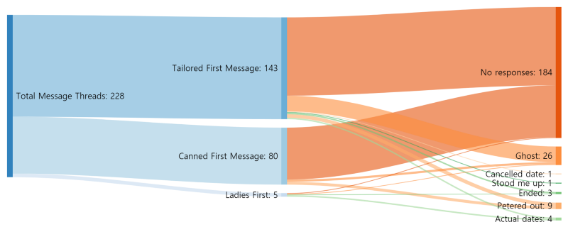

> I have initiated 223 conversations with ladies, out of which 80 where such that I could have copy pasted to basically anyone, and 143 were inspired by information from their profile. (The canned ones usually came to be because they provided either zero useful information on their profile or I just couldn’t think of anything interesting specific to them.)

> Trivia:

> 2 out of 5 conversation initiated by ladies ended in dates.  
> Zero of my non original messages ended in dates.  
> 25,3% of tailored first messages got any sort of response while only 8,5% of canned ones did.  
> My shortest first message was 20 characters while the longest was 1779.  
> Still single.

Also, it provides a definition of terms commonly. Not that **ghosted** and **petered out** may have different meanings in other diagrams.

> **Ghosted** means that at one point my conversational partner simply stopped responding without any indication or explanation. (Does not include the woman who stood me up, because I didn’t want duplication.)

> **Petered out** is when the convo went so poorly that there was no motivation to go further.

> **Ended** is when some sort of end was explicitly stated.

#### My 5 months on Hinge (match results, statistics, and trends)

> This is in Chicago with distance preferences set to <5 miles

> I am white and 1 year removed from college graduation (big school)

> I was a premium member from 4/16/2018 to 6/19/2018 (\$40 total)

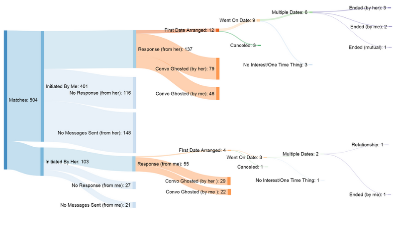

> Hinge is a very unique dating app. It is similar to Tinder/Bumble in that you can “like” or “pass” on other people’s profiles, however it is very different all together. Your profile consists of up to 6 pictures, basic personal information, and your answers to 3 of Hinge’s “questions”, all of which can be specifically “liked” by someone viewing your profile. These “questions” are a pretty fun way to show people a little more of who you are. They can range from “What’s your typical Sunday?” to “Worst Fad I Participated In”. All in all, it is a much more personalized online dating experience compared to your usual sites.

#### My 180 Days of Lesbian Online Dating

> I thought this was neat to see the differences. I don’t have nearly the same amount of data, though that’s not really needed to see the blatant differences. I’d love to see a straight women or gay guy or anyone else do this as well!

> Another note: You can’t start conversations with Gifs on OkCupid, just Tinder.

> But wait! There’s more. [I made some with extra information breaking down OkCupid and Tinder](https://i.imgur.com/ai9keMe.png)

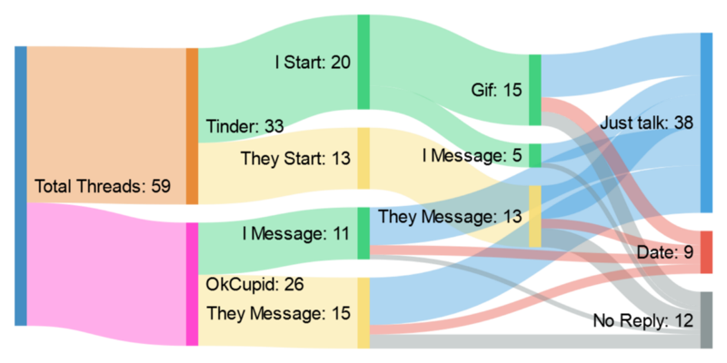

> In line with the other OP here are some facts/stats

> I’m in my late twenties and live in a large East Coast city in the US.  
> Both of my profiles stated that I wasn’t looking for anything serious.  
> I was kinda stood up once, but I included it in the “peterd out.”  
> Talking about “success rates” is difficult because my goal isn’t to meet every woman I talk to (I even ignore a good many). **But** I’m not still single.

Or maybe the net one

#### Two months of dating with Bumble

> I’m 26F, a graduate student in the sciences living in a small college town. I met a previous boyfriend of mine on Bumble last year, and after that relationship ended and I started dating again, I thought I’d keep track of how things went. These are my results from dating over approximately 2 months (Aug-Sep), meeting people in person and also using Bumble.

> I wanted to find someone to date monogamously, so in my mind finding another “relationship” was a success. Unfortunately, it has since ended (I ended things), and I am on a dating reprieve for a little while over the holidays and am focusing on other things for a bit. The quiet is nice :) I will likely return to Bumble in a few weeks. Usually dating doesn’t go this quickly for me, but there were many new people in my area because of the start of the semester.

#### Twelve thousand right swipes on Bumble

> 0.4% (48/12,098) of the women I swiped right on also swiped right on me. Of those, about 23% (11/48) started a conversation. Of those, I went on 2 first dates. I went on zero second dates from Bumble. — from [Twelve thousand right swipes on Bumble](https://www.reddit.com/r/dataisbeautiful/comments/7peawj/twelve_thousand_right_swipes_on_bumble_oc/)

### Conclusion

I got sucked into reading these stories. Tough, I noticed that only a small fraction of initial matches (let alone swipes) lead to any meaningful interaction.

The most famous one is [the classic diagram of Napoleon’s invasion of Russia](https://www.edwardtufte.com/tufte/minard). While no rejection or ghosting is as cold and deadly as Russian winter, maybe these do decimate hope as much as Napoleon’s army?

It may be hard to compare the raw number of matches, as these experiments differ by gender, orientation, location, duration and swiping habits. [For online dating looks do matter](https://www.gwern.net/docs/psychology/okcupid/yourlooksandyourinbox.html) (to the point that [it discourages mixed-attractiveness couples](https://priceonomics.com/online-dating-and-the-death-of-the-mixed/)), [imbalance in gender ratios change the dating dynamics](http://jonathansoma.com/singles/) (see [NYC](http://visualizing.nyc/nyc-zip-codes-singles-map/) & [SF](http://visualizing.nyc/bay-area-zip-codes-singles-map/)). And oh, [guys, unless you are really hot you are probably better off not wasting your time on Tinder](https://medium.com/@worstonlinedater/tinder-experiments-ii-guys-unless-you-are-really-hot-you-are-probably-better-off-not-wasting-your-2ddf370a6e9a).

Moreover, the set of people creating and sharing such diagrams may be different from the general population. If there are dating geeks, does it mean that they are much better at dating? Or that they are nerds who prefer to tinker with their spreadsheets and data visualization that actually dating?

If you intend to [create a Sankey flow chart](http://sankeymatic.com/build/) (by all means I encourage you to do so!), make sure you won’t create [worthless bottlenecks](https://www.reddit.com/r/dataisbeautiful/comments/7s6vam/comparing_flow_charts_with_and_without_worthless/). Also, at least to my taste, it is cleaner to make fail branches (“no response” or “didn’t reply”) shorter.

Piotr is an author of [Dating for nerds series](https://p.migdal.pl/2017/07/23/dating-for-nerds.html) and mentored [Does AI have a dirty mind, too?](https://medium.com/@marekkcichy/does-ai-have-a-dirty-mind-too-6948430e4b2b) project by [Marek K. Cichy](https://medium.com/u/5bf0995463b). And creates [D3.js and Vue.js data visualizations](https://p.migdal.pl/projects/).

Also, if you want to collaborate on a project, I thought about correlating latent traits from [Generating custom photo-realistic faces using AI](https://blog.insightdatascience.com/generating-custom-photo-realistic-faces-using-ai-d170b1b59255) to one’s attractiveness. If interested, [drop me an email](https://p.migdal.pl/)!
