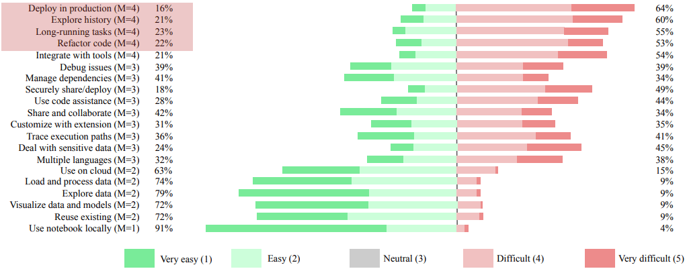
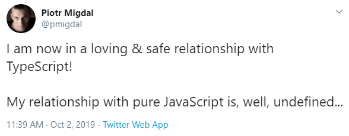
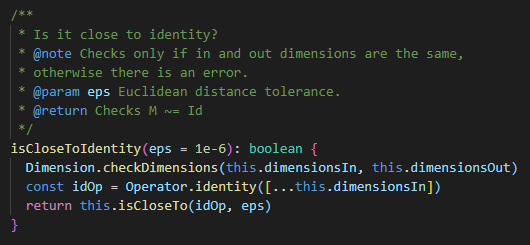
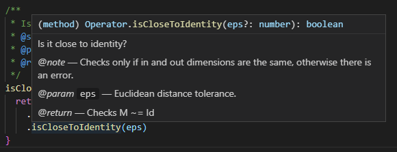
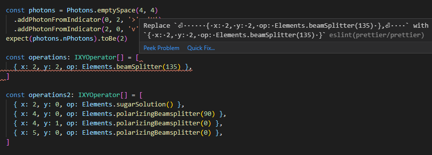
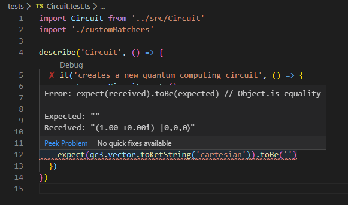
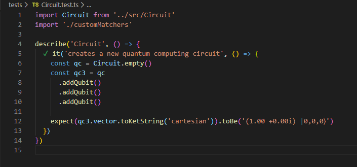
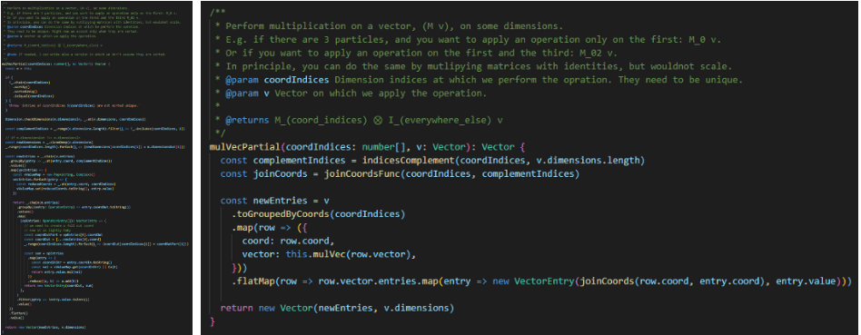

_On TypeScript, ESlint, jest, TSDoc, Travis-CI, and VSCode (with inspirations from the Zen of Python)_

It is fun to write fast without constraints, and run code in a flash. That is why I fell in love with Python and the Jupyter Notebook environment, a great tool for prototyping and interacting with data. However, interactive notebooks fall short when you want to write bigger, maintainable code. See the [What’s wrong with computational notebooks?](http://web.eecs.utk.edu/~azh/blog/notebookpainpoints.html) survey:



Restructuring and cleaning up code (refactoring) is being listed as one task notebooks are not meant for. For further reading on the pros and cons of notebooks, see [The First Notebook War](https://yihui.org/en/2018/09/notebook-war/).

While I knew the concept of tests, I got discouraged by some overzealous test-driven development practices which make feature development slow and experimentation — even slower. In data science, you pretty much need to take an iterative approach to data. Creating meticulous tests before exploring the data is a big mistake, and will result in a well-crafted garbage-in, garbage-out pipeline. We need an environment flexible enough to encourage experiments, especially in the initial place.

Moreover: writing clever code is tempting! Why should you deny yourself the fun of solving a seemingly difficult problem in a one-liner? Well, there is a word of caution, and it’s called [the Kernighan’s Law](https://github.com/dwmkerr/hacker-laws#kernighans-law):

> Debugging is twice as hard as writing the code in the first place. Therefore, if you write the code as cleverly as possible, you are, by definition, not smart enough to debug it.

In other words: being smart won’t make you automatically a good software engineer. The combination of high intelligence and no software engineering skills often results in code-golf-style contraptions that do the job but are completely incomprehensible for anyone else (including their authors’ future selves). This may explain the baseline [code quality in academia](https://academia.stackexchange.com/questions/23237/why-are-papers-without-code-but-with-results-accepted/23238#23238).

---

Last autumn, I got invited to the Centre for Quantum Technologies at the National University of Singapore to lead the creation of [Quantum Game with Photons 2](https://github.com/Quantum-Game/). It is a bigger project, with a few people on board (with various skillsets), so things that would work for solo coding won’t fly there. And I learned a lot, by trial and error.

I got quite a few insights from things most software engineers take for granted: **types** and **tests**. If you are a fellow (ex-)scientist, have ADHD (I do) or for any other reason find yourself too impatient, or smart, to set types and write tests: this post is for you!

In this post I will discuss:

- TypeScript as an improvement over JavaScript
- Code documentation with TSDocs
- ESLint as a “spell checker” and automatic style guide for code
- Tests (with jest framework)
- Continuous integration with Travis CI and Codecov

# TypeScript

Since it is a browser-based game, JavaScript was an obvious choice. We chose [TypeScript](https://www.typescriptlang.org/) (_“JavaScript with types”_) as its dialect, and never looked back. We all used [VSCode](https://code.visualstudio.com/) open-source editor, due to its TypeScript support and rich plugin ecosystem

[](https://twitter.com/pmigdal/status/1179329959598313473)

In principle, types are not necessary. All in all, everything in the computer is a long sequence of zeros and ones. But almost always we want to **restrict** what we can do with a particular variable to things that make sense, in the given context. There are exotic cases when we want to treat 0s and 1s of a **float** using operations for an **integer**, vide [fast inverse square root](https://en.wikipedia.org/wiki/Fast_inverse_square_root). But there are rare exceptions that do deserve a few extra lines of switching between types.

In Python, when trying to do a dubious operation, you get an error pretty soon. In JavaScript… an undefined can fly through a few layers of abstraction, causing an error in a seemingly unrelated piece of code. We can get funny results due to using different types. Open a console, write:

`function add(a, b) { return +(a + b) }`

And then try to `add(2,2)` and `add('2', 2)`. In both cases, you get a number… but, is it the same one? Sure, this case is trivial. But what if this function were much more complicated, had a few arguments (in non-obvious order), and its input arguments came from different functions (from modules or packages you don't maintain)?

Even in Python, the error happens in the runtime. Why not see it coming while writing code? In TypeScript, with a few keystrokes, we can set:


I found that the overhead to use types in TypeScript is minimal (if any). When writing a new class, method or function, very often it is faster. Sure, I need to specify types of input and output. But then I get speedup due to autocompletion, hints, and linting if for any reason I make a mistake.

Types give built-in testing — that a given function takes arguments of particular types. However, they also help greatly with the code readability. When seeing `changeVolume(volume: number)` you don’t need to guess if `id` is a number, string, boolean, `Volume` object, or Cthulhu-knows-what.

So, let’s start with a few lines of [Zen of Python](https://www.python.org/dev/peps/pep-0020/):

> Explicit is better than implicit.
>
> In the face of ambiguity, refuse the temptation to guess.

---

To be fair: there is quite a lot missing in TypeScript types. For example, integer types would help a lot in typical tasks such as accessing an array or iterating a loop; even if they are stored as floats, I want to make sure someone won’t take the 2.5-th element of a list.

Still, for me, TS is a day and night difference with JavaScript.

### Further reading

- [Is TypeScript worth it? - LogRocket Blog](https://blog.logrocket.com/is-typescript-worth-it/)

# TSDoc

Good comments do clarify code. [TSDoc](https://github.com/microsoft/tsdoc) is a way of writing TypeScript comments where they’re linked to a particular function, class or method (like [Python docstrings](https://www.python.org/dev/peps/pep-0257/)).





If we are clueless about what to write in the description, it may be a sign of a more fundamental problem:

> If the implementation is hard to explain, it's a bad idea.
>
> If the implementation is easy to explain, it may be a good idea.

Additionally, it is possible to create the whole documentations with [TypeDoc](https://github.com/TypeStrong/typedoc), see [Operator for Quantum Tensors](https://quantum-game.github.io/quantum-tensors/classes/_operator_.operator.html).

### Further reading

- [Intro to TypeScript Documentation with TSDoc](https://coryrylan.com/blog/intro-to-typescript-documentation-with-tsdoc)

# ESLint

Since the code runs, it is fine, right?


Well, unless someone needs to read it. A collaborator, or yourself in 6 months. When the other person needs to develop it (use, expand, or rewrite) — there are so many things that can go wrong, be misunderstood, or take an unproportionate amount of time. When it comes to code, I have a strong belief that:

> Readability counts.

[ESLint](http://eslint) does automatic code linting — it’s “spell checking” for code and serves a few purposes:

- marking things that are incorrect,
- marking things that are unnecessary or risky (e.g. `if (x = 5) { ... }`)
- setting a standard way of writing code.

The first two are a no-brainer. It may be debatable what is “risky”, but we can customize that if needed.

[](http://oppressive-silence.com/comic/oh-no-the-robot)

Source: [oppressive-silence.com/comic/oh-no-the-robots](http://oppressive-silence.com/comic/oh-no-the-robots). Using [no-cond-assign](https://eslint.org/docs/rules/no-cond-assign) would have saved their lives.

The standardization is less obvious. Personally, I like setting the linter to be as strict as possible, going in line with a controversial piece of wisdom from the Zen of Python:

> There should be one — and preferably only one — obvious way to do it.

By reducing ways to write something, it reduces the number of unnecessary choices (_should I indent it or not?_) and allows me to use my cognitive resources in a more meaningful way.

Moreover, it makes it much easier to collaborate. No more inconsistencies because one uses **tabs** and the other — **spaces**. Or different name conventions. Even if you verbally decide to use **two spaces**, it takes some cognitive power to self-police oneself… with no guarantee.

[ESLint](https://eslint.org/) can be configured in various ways, to be laid back or strictly pedantic. There are many plugins with settings for particular languages and frameworks (such as TypeScript, Vue, etc) and styles (I recommend [Airbnb style JavaScript style guide](https://github.com/airbnb/javascript/) and [Airbnb TypeScript](https://www.npmjs.com/package/eslint-config-airbnb-typescript)).

> Beautiful is better than ugly.

Many plugins go with two possible settings: base (only errors) and recommended (enforcing good practices with style). I suggest going by default for the latter. If you need to override an option, it is easy. And IMHO it does not matter nearly as much what style you choose (if you want, go for tabs for indentation — you have my official blessing) as long as it is restrictive and enforced ruthlessly.


I do have a love and hate relationship with [Prettier](https://prettier.io/), another a code formatter purely focused on style. In some cases, it makes code, well, prettier and more standardized. However, for many things (say: indentations, trailing characters) Airbnb can do the job. I have also found that a restrictive approach to line width can occasionally produce an inconsistent style (and is pretty vocal about that).



### Further reading

- [typescript-eslint/typescript-eslint](https://github.com/typescript-eslint/typescript-eslint/blob/master/docs/getting-started/linting/README.md)
- [Integrating Prettier + ESLint + Airbnb Style Guide in VSCode](https://blog.echobind.com/integrating-prettier-eslint-airbnb-style-guide-in-vscode-47f07b5d7d6a)
- [Keep Code Consistent Across Developers The Easy Way — With Prettier & ESLint](https://itnext.io/keep-code-consistent-across-developers-the-easy-way-with-prettier-eslint-60bb7e91b76c)

# jest

Testing seemed the way to slow down development, kill fun and momentum.

> Errors should never pass silently.

I won’t fool you: tests require you to write a few more lines of code (see [jest](https://jestjs.io/) examples). But ask yourself: when writing a longer function, does it work on the first go? Always, no exceptions?

Probably you have the same doubt, and at least test it somehow: open an app and eyeball it if it works, or open a console and check if you get a correct result (this REPL / Jupyter Notebook approach for testing).

This interactive approach is fine… but manual. You need to do it each time you change your function. So, how about testing it once and then saving it for further use?

Well, with [VSCode plugin for jest](https://github.com/jest-community/vscode-jest) you can do that! Write a new test and the result. If you want to make it REPL-like, instead of writing `console.log(x.toString())` use `expect(x.toString()).toBe('')` and you will directly get the result.



Then, we can set it as a test. We wrote once but turned into a guardian of our code.



Tests do not prove that the code works. They safeguard against mistakes, and usually stupid mistakes (e.g. instead of a sorted list in ascending order you get one in descending).

It is fine to start adding tests gradually, by adding a few tests to things that are the most difficult (ones you need to keep fingers crossed so they work) or most critical (simple but with many other dependent components).

But, if you want to gamify adding tests, there is a way to go!

### Further reading

- [Unit Testing with Typescript and Jest](https://dev.to/muhajirdev/unit-testing-with-typescript-and-jest-2gln)

# Travis CI

A typical issue with academic code is that it runs on a single computer, during a full moon. So how about testing it externally, with every single commit?

`](./travis_ci_checks_pull_request.png)

Continuous integration makes it easy to check against cases when the code:

- does not work (but someone didn’t test it and pushed haphazardly),
- does work only locally, as it is based on local installations,
- does work only locally, as not all files were committed.

Sounds too good to be easy? Well — to my surprise, I set it with a few clicks at [Travis CI](https://travis-ci.com/Quantum-Game/quantum-tensors), and by creating a [.travis.yml](https://github.com/Quantum-Game/quantum-tensors/blob/master/.travis.yml) file in the repo:

```{yaml}
language: node_js
node_js: node

before_script:
  - npm install -g typescript
  - npm install codecov -g

script:
  - yarn lint
  - yarn build
  - yarn test
  - yarn build-docs

after_success:
  - codecov
```

Conversely, if the code works passes, but does not work locally, there is a fair chance that the problem is with local installation (e.g. conflicting paths) rather than the code itself.

---

And the gamification part! Writing tests for all functions is boring… unless I get some score for that, as visible feedback. With [Codecov](https://codecov.io/gh/Quantum-Game/quantum-tensors/) it is easy to make jest & Travis CI generate one more thing:

`](./codecov.png)

### Further reading:

- [A first impression of GitHub Actions CI/CD](https://www.eficode.com/blog/github-actions)
- [Migrating from TravisCI to Github Actions](https://bravelab.io/blog/migrating-from-travisci-to-github-actions-1/)

# Ending notes

Sure, all of it is fun. But: did it help me? For example: believe me or not, but I refactored a piece of tensors numerics in one go, with no errors:



Thanks to types, and TSDocs, it was possible to see slips while writing.
Thanks to tests, once rewritten, I was reassured it does the same thing.

I don’t believe I would manage to do the same things without types and tests.

#### Takeaways

A few takeaways:

- Types and tests save you from stupid mistakes, and are gifts for your future self!
- Use ESLint and configure it to be your strict, but fair, friend.
- Think of tests as a permanent console.
- Types: It is not only about checks. It is also about code readability.
- Testing with each commit makes fewer surprises when merging Pull Requests.

Does it slow down development?

Well, my rule-of-thumb is: **_would I use it during a hackathon?_**

In fact, I learned TypeScript during a hackathon! For other parts: I would use ESLint in full strength, tests for some (especially end-to-end, to make sure a commit does not make project crash), and add continuous integration.

#### Thanks

I hope you’ve learned something — tools, or an overall approach that can be applied to any language. I would like to thank Rafał Jakubanis, Anna Karpiuk, Philippe Cochin, Marek Cichy and Klem Jankiewicz for valuable remarks on the draft.
