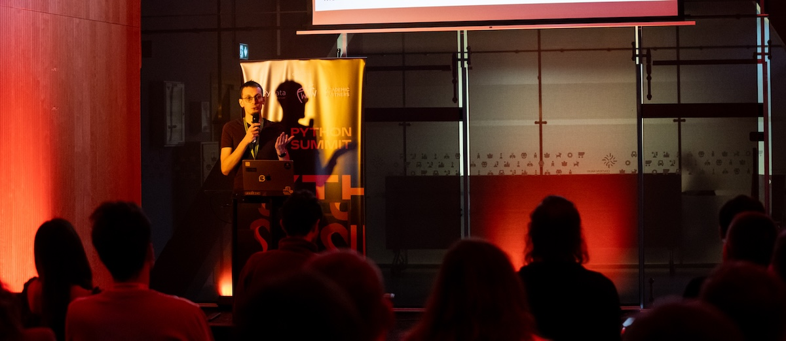
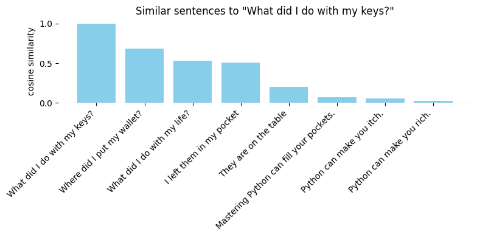
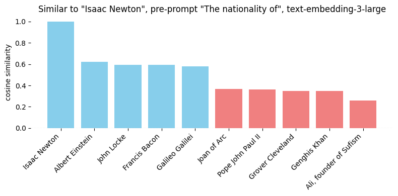
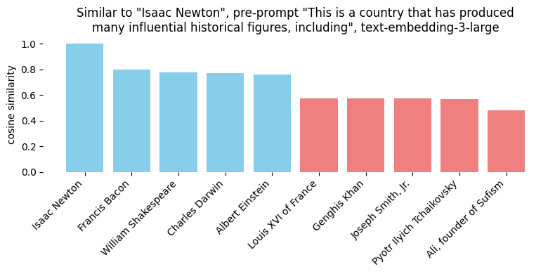
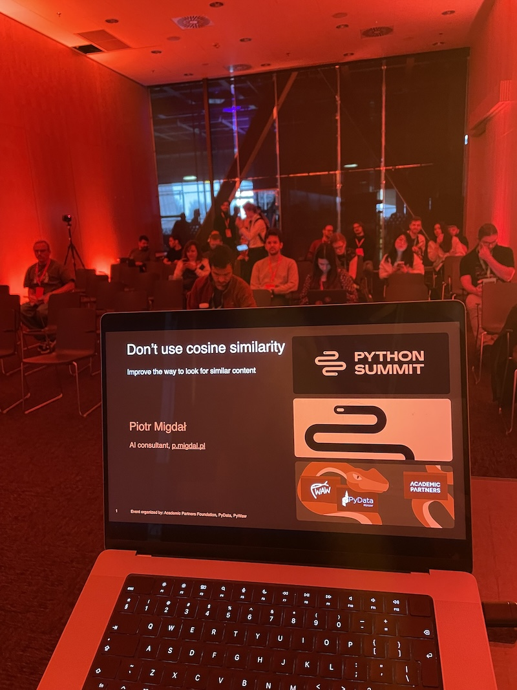

Midas turned everything he touched into gold. Data scientists turn everything into vectors.
We do it for a reason - as gold is the language of merchants, vectors are the language of AI[^1].

## Embeddings

Embeddings are so captivating that my most popular blog post remains [king - man + woman = queen; but why?](https://p.migdal.pl/blog/2017/01/king-man-woman-queen-why).
We have [word2vec](https://p.migdal.pl/blog/2017/01/king-man-woman-queen-why), [node2vec](https://snap.stanford.edu/node2vec/), [food2vec](https://jaan.io/food2vec-augmented-cooking-machine-intelligence/), [game2vec](https://github.com/warchildmd/game2vec), and if you can name it, someone has probably turned it into a vec. If not yet, it's your turn!

When we work with raw IDs, we're blind to relationships. Take the words "brother" and "sister" - to a computer, they might as well be "xkcd42" and "banana". But with vectors, we can chart entities and relationships between them - both to provide as a structured input to a machine learning models, and on its own, to find similar items.

Let's focus on sentence embeddings from Large Language Models (LLMs), as they are one of the most popular use cases for embeddings. Modern LLMs are so powerful at this that they can capture the essence of text without any fine-tuning. In fact, recent research shows these embeddings are almost as revealing as the original text - see Morris et al., [Text Embeddings Reveal (Almost) As Much As Text](https://arxiv.org/abs/2310.06816), (2023). Yet, with great power comes great responsibility.

## Example

Let's look at three sentences:

- A: _"Python can make you rich."_
- B: _"Python can make you itch."_
- C: _"Mastering Python can fill your pockets."_

If you threated them as raw IDs, there are different strings, with no notiuon of similarity. Using string similarity ([Levenshtein distance](https://en.wikipedia.org/wiki/Levenshtein_distance)), A and B differ by 2 characters, while A and C are 21 characters apart. Yet semantically (unless you're allergic to money), A is closer to C than B.

We can use [OpenAI text-embedding-3-large](https://platform.openai.com/docs/guides/embeddings), to to get the following vectors:

- A: `[-0.003738, -0.033263, -0.017596,  0.029024, -0.015251, ...]`
- B: `[-0.066795, -0.052274, -0.015973,  0.077706,  0.044226, ...]`
- C: `[-0.011167,  0.017812, -0.018655,  0.006625,  0.018506, ...]`

These vectors are quite long - text-embedding-3-large has up 3072 dimensions - to the point that [we can truncate them at a minimal loss of quality](https://openai.com/index/new-embedding-models-and-api-updates/).
When we calculate cosine similarity, we get 0.750 between A and C (the semantically similar sentences), and 0.576 between A and B (the lexically similar ones). These numbers align with what we'd expect - the meaning matters more than spelling!

## What is cosine similarity?

When comparing vectors, there's a temptingly simple solution that every data scientist reaches for — cosine similarity:

$$ \text{cosine similarity}(\vec{a}, \vec{b}) = \frac{\vec{a} \cdot \vec{b}}{\|\vec{a}\| \|\vec{b}\|} $$

Geometrically speaking, it is the cosine of the angle between two vectors. However, I avoid thinking about it this way - we're dealing with spaces of dozens, hundreds, or thousands of dimensions. Our geometric intuition fails us in such high-dimensional spaces, and we shouldn't pretend otherwise.

From a numerical perspective, it is a dot product with normalized vectors.
It has some appealing properties:

- Identical vectors score a perfect 1.
- Random vectors hover around 0 (there are many dimensions, so it averages out).
- The result is between -1 and 1.

Yet, this simplicity is misleading. Just because the values usually fall between 0 and 1 doesn't mean they represent probabilities or any other meaningful metric. The value 0.6 tells little if we have something really similar, or not so much. And while negative values are possible, they rarely indicate semantic opposites — more often, the opposite of something is gibberish.

::gallery{ width=1 }

#caption
When using cosine similarity on [Glove vectors](https://nlp.stanford.edu/projects/glove/) (`glove.6B.300d`), the closest words to "dog" are predictable, the farthest - not. You can play with it [here](https://colab.research.google.com/github/stared/thinking-in-tensors-writing-in-pytorch/blob/master/rnns/Word%20vectors.ipynb).
::

In other words, cosine similarity is the duct tape of vector comparisons. Sure, it sticks everything together — images, text, audio, code — but like real duct tape, it's a quick fix that often masks deeper problems rather than solving them. And just as you wouldn't use duct tape to permanently repair a water pipe, you shouldn't blindly trust cosine similarity for all your vector comparison needs.

Like a Greek tragedy, this blessing comes with a curse: when it works, it feels like effortless magic. But when it fails, we are clueless, and and we often run into importu fixes, each one bringing issues on its own.

## Relation to correlation

[Pearson corelation](https://en.wikipedia.org/wiki/Pearson_correlation_coefficient) can be seen as a sequence of three operations:

- Subtracting means to center the data.
- Normalizing vectors to unit length.
- Computing dot products between them.

When we with vectors that are both centered ($\sum_i v_i = 0$) and normalized ($\sum_i v_i^2 = 1$), Pearson correlation, cosine similarity and dot product are the same.

In practical cases, we don't want to center or normalize vectors during each pairwise comparison - we do it once, and **just use dot product**. In any case, when you are fine with using cosine similarity, you should be as fine with using Pearson correlation (and vice versa).

## Problems with cosine similarity as a measure of similarity

Using cosine similarity as a **training objective** for machine learning models is perfectly valid and mathematically sound.
As we just seen, it's a combination of two fundamental operations in deep learning: dot product and normalization.
The trouble begins when we venture beyond its comfort zone, specifically when:

- The cost function used in model training isn't cosine similarity (usually it is the case!).
- The training objective differs from what we actually care about.

### Has the model ever seen cosine similarity?

A common scenario involves training with unnormalized vectors, when we are dealing with a function of dot product - for example, predicting probabilities with a signoid function $\sigma(v_a \cdot v_b)$ and applying log loss cost function. Other networks operate differently, e.g. they use Euclidean distance, minimized for members of the same class and maximized for members of different classes.

The normalization gives us some nice mathematical properties (keeping results between -1 and +1, regardless of dimensions), but it's ultimately a hack. Sometimes it helps, sometimes it doesn't — see the aptly titled paper [Is Cosine-Similarity of Embeddings Really About Similarity?](https://arxiv.org/abs/2403.05440).

Sure, back in the days of an image detection model VGG16 I was using logit vectors from the classification layer and Pearson correlation to find similar images. It kind of worked - bring fully aware it is a hack and just a hack.

We are safe only if the model itself uses cosine similarity or a direct funciton of it - usually implemented as a dot product of vectors that are kept normalized. Otherwise, we use a quantity we have no control over. It may work in one instance, but not in another. If some things are extremely similar, sure, it is likely than many different measures of similarity will give similar results. But if they are not, we are in trouble.

In general, it is a part of a broader subject of unsupervised machine vs self-supervised learning.
In the first one, we take an arbitrary function and we get some notions or similarity. Yet, there is no way to evaluate it.
The second one, self-supervised learning, is a predictive model, in which we can directly evaluate the quality of prediction.

### Is it the right kind of similarity?

And here is the second issue - even if [a model is explicitly trained on cosine similarity](https://cdn.openai.com/papers/Text_and_Code_Embeddings_by_Contrastive_Pre_Training.pdf), we run into a deeper question: whose definition of similarity are we using?

Consider books. For a literary critic, similarity might mean sharing thematic elements. For a librarian, it's about genre classification. For a reader, it's about emotions it evokes. For a typesetter, it's page count and format. Each perspective is valid, yet cosine similarity smashes all these nuanced views into a single number — like trying to describe a wine using only its alcohol percentage.

Take my Obsidian daily notes as an example. Should yesterday's todo list be considered similar to other daily notes or to notes about relevant projects? Cosine similarity gives us an answer, but not necessarily the one I am looking for.

](./cartoon-espresso-word2vec.jpg)

In the US, word2vec might tell you espresso and cappuccino are practically identical. It is not a claim you would make in Italy.

## When it falls apart

Let's have a task that looks simple, a simple quest from our everyday life:

- _"What did I do with my keys?"_

Now, using cosine similarity, we can compare it to other notes:

- _"In left them my pocket"_
- _"There are on the table"_
- _"What did I put my wallet?"_
- _"What I did to my life?"_

::gallery{ width=1 }

#caption
The closest match is not an plausible answer to our question - instead, it is another question. With sentence embedding cosine similarity, we are more likely to question our own life than to solve our mundane task.
Fortunatelly, sentences about Python are close to zero - as they are not related.
::

And remember, this is just a toy example with five sentences. In real-world applications, we're often dealing with thousands of documents — far more than could fit in a single context window. As your dataset grows, so does the noise sensitivity, turning your similarity scores into a game of high-dimensional roulette.

## So, what can we use instead?

### The most powerful approach

The best approach is to directly use LLM query to compare two entries. So, first, start with [a powerful model of you choice](https://lmarena.ai/?leaderboard). Then, we can write somethinh in the line of:

> "Is {sentence_a} similar to {sentence_b}?"

This way we harness the full power of an LLM to extract meaningful comparisons. We typically want our answers in structured output - what the field calls "tools" or "function calls" (which is really just a fancy way of saying "JSON").

However, in most cases this approach is impractical - we don't want to run such a costly operation for each query. Unless our dataset is very small, it would be prohibitively expensive. Even with a small dataset, the delays would be noticeable compared to a simple numerical operation.

### Extracting the right features

So, we can go back to using embeddings.
But instead of blindly trusting a black box, we can directly optimize for what we actually care about by creating task-specific embeddings.
There are two main approaches:

- Fine-tuning (teaching an old model new tricks by adjusting its weights).
- Transfer learning (using the model's knowledge to create new, more focused embeddings).

Which one we use is ultimetaly a technical question - depending to the access to the model, costs, etc.
Let's start with a symmetric case. Say we want to ask, **"Is A similar to B?"** We can write this as:

$$\sigma(u_A \cdot u_B)$$

where $u = M v$, and $M$ is a matrix that reduces the embedding space to dimensions we actually care about. Think of it as decluttering — we're keeping only the features relevant to our specific similarity definition.

But often, similarity isn't what we're really after. Consider the question **"Is document B a correct answer to question A?"** (note the word "correct") and the relevant probability:

$$\sigma(q_A \cdot k_B)$$

where $q = Q v$ and $k = K v$. The matrices $Q$ and $K$ transform our embeddings into specialized spaces for questions and answers. It's like having two different languages and learning to translate between them, rather than assuming they're the same thing.

This approach works beautifully for retrieval augmented generation (RAG) too, as we usually care not only about similar documents, but about the relevant ones.

But where do we get the training data?
We can use the same AI models we're working with to generate training data.
Then feed it into PyTorch, TensorFlow, or your framework of choice.

### Pre-prompt engineering

Sure, we can train model. Maybe even train on artifically generated data - but what if we want to avoid this step entirely? We got used to zero-shot learning, and it is not easy to go back.

One of the quickest fixes is to add prompt to the text, so to set the apparent context.
A simple example - let's have the list of [Time's 100 Most Significant Figures in History](https://ideas.time.com/2013/12/10/whos-biggest-the-100-most-significant-figures-in-history/). Let's say we want to see who is the most similar to Isaac Newton.


No surprise, it's other physicists and natural philosophers.
Yet, let's say we want to focus on his nationality - so we add a prompt _"Nationality of {person}"_.



Sadly, the results are underwhelming - sure, Galileo went a few places down, but Albert Einstein is listed as the most similar.
So, let's try another approach, by making nationality the subject of the sentence - _""This is a country that has produced many influential historical figures, including {person}"_.



Now we get much better answer!
To be clear - while I have found this approach useful, it is not a silver bullet.
Depending on how to formulate the prompt, we can get a slight bias towards our goal, or something actually solving our problem.

### Rewriting and context extraction

Another approach is to preprocess the text before embedding it. Instead of using raw conversations with clients, distill them down to their essential needs. It's like having a translator who not only speaks both languages but also knows how to cut through the noise.

Here's a generic trick I often use — I ask the model:

> "Rewrite the following text in standard English using Markdown. Focus on content, ignore style. Limit to 200 words."

This simple prompt works wonders. It helps avoid false matches based on superficial similarities like formatting quirks, typos, or unnecessary verbosity.

Often we want more - e.g. to extract information from a text, while ignoring the rest.
For example, let's say with have a chat with the client and we want to suggest relevant page, be it of FAQ, or a product recommendation. A naive way would be to compare their discussion's embedding with the embeddings of our pages. A better one is first to fransform the conversation into possible products and then touse em

> "You have a conversation with a client. Summarize their needs and pain points in up to 10 Markdown bullet points, up to 20 words each. Take into account both explicitly stated needs as well as ones based on the context, tone, "

Even if someone writes their question as an epic poem (yes, it happens), they'll get a clear, prosaic answer that focuses on what they actually need to know.

## Recap

Let's wrap this up with some key takeaways:

- Cosine similarity is not a probability, no matter how tempting it is to interpret it that way
- Context matters more than numbers - embeddings capture various types of similarities, not necessarily the ones you care about
- Instead of blindly trusting cosine similarity, you can:
  - Fine-tune models for your specific needs
  - Use prompt engineering to focus on relevant features
  - Transform embeddings with task-specific matrices
  - Generate high-quality training data using LLMs themselves

Remember: just because two vectors point in the same direction doesn't mean they're telling the same story. Sometimes you need to be the translator, not just the calculator.

To be clear if a solution is stupid but it works, it is not stupid.



## Thanks

I first presented this topic as a flash talk at [Warsaw AI Breakfast](https://lu.ma/warsaw-ai-breakfast) - I am grateful for feedback from Grzegorz Kossakowski and Max Salamonowicz.
I thank Rafał Małanij for inviting me to speak at [Python Summit 2024 Warsaw](https://python-summit.pl/en/).
This blog post stemmed from interest after these presentations, as well as [multiple questions on the LinkedIn post](https://www.linkedin.com/posts/piotrmigdal_llm-ai-activity-7271894516058509312-e489?utm_source=share&utm_medium=member_desktop).

[^1]: To the point that my Jupyter Notebook intro to deep learning is called [Thinking in tensors, writing in PyTorch](https://github.com/stared/thinking-in-tensors-writing-in-pytorch)

---

## NOTES

It is NOT a part of the blog post, just some editing context to see what was discussed on LinkedIn - to make sure I cover the most important points, and as the same time - write in a way that is accessible and interesting to this audience.

[LinkedIn post](https://www.linkedin.com/posts/piotrmigdal_llm-ai-activity-7271894516058509312-e489?utm_source=share&utm_medium=member_desktop)

This Wednesday, I'll be giving a technical talk on why one of the most common methods for finding similar items with AI is flawed—and how to address its limitations. At the very least, you'll learn why it's crucial to understand these limitations.

"Don't Use Cosine Similarity" at Python Summit

Here’s a tl;dr:

In most models, embeddings are byproducts. While they do reflect some similarities, there's no guarantee about the kind of similarity they prioritize.

For example, let’s say you want to find an answer to a question. You turn the question into a vector and search for similar vectors using cosine similarity. What do you get? Likely, you'll find similar questions instead. And if you’re lucky, they’ll match by topic—though they might also match by length, format, writing style, or even shared typos and grammatical errors.

A blog post on this topic is coming soon.

hashtag#llm hashtag#ai

George Deac • 2nd
2B or not 2B that is 0xFF
2d
I always thought that it also depends on the model training, cos sim is used because it's the least computationally intensive (being basically a Pearson correlation with the assumption that vectors are mean centered). Dot product, euclidean distance are not used because of the curse of dimensionality loss of information, and distribution aware transport metrics are too expensive.
2 Replies 2 Replies on George Deac’s comment
Piotr Migdał Author
Technical Lead in AI | ex-CTO of Quantum Flytrap | Open for Ambitious Challenges
21h
George Deac Cosine similarity is precisely a dot product, after rescaling (typically used once, rather than for each query). And (for unit vectors), it is equivalent to the Euclidean distance.

This correlation is often a hack, as it uses a different metric than the one on which the model was trained. Sure, similar things get close to each other, but not necessarily according to the same type of similarity we care about.
George Deac • 2nd
2B or not 2B that is 0xFF
9h
(edited)
Piotr Migdał exactly all three are linked, cos sim only accounts for the direction, euclidean norm for the magnitude and dot product combines both.

They are also purely geometric, unlike for example the Pearson correlation which is a cos sim centered around the assumption of a centered statistical variance field (which does not necessarily hold in the latent space).

There are also the newer correlation formulations that don't purely revolve around the classical assumption, the newer ones that extend the transport optimization theory. Maybe an optimized solution that can be integrated within deep models can be formulated from here, I've also been researching this recently.
Luís Felipe Oliveira de Melo • 3rd+
M.Sc. AI Engineer | Machine Learning | Deep Learning | Data Science | Data | PyTorch | ONNX | Computer Vision | C++ | Python
1d
(edited)
It depends solely on the model training. The model will convert to a subspace manifold that matches the metrics used as a loss function. If the adopted loss function somewhat induced a hyper spherical subspace that prioritizes similarity over one specific feature, then it's appropriate to adopt cosine similarity. Otherwise you're just counting into luck that the distributions of the feature target in training and desired feature retrieval are somewhat correlated.

At least that's why losses like Additive Margin Loss and similar ones were suggested in comparison to softmax and center loss
2 Replies 2 Replies on Luís Felipe Oliveira de Melo’s comment
Piotr Migdał Author
Technical Lead in AI | ex-CTO of Quantum Flytrap | Open for Ambitious Challenges
21h
Luís Felipe Oliveira de Melo There will be a blog post on that. But a short version is that: unless cosine sim is the training cost function AND the objective is precisely the same as ours, it is a hack.
Lukas Valatka • 2nd
Software Engineer - Data & Machine Learning
2d
Isn't it just fine if you pre-train on cosine similarity?
1 Reply 1 Comment on Lukas Valatka’s comment
Piotr Migdał Author
Technical Lead in AI | ex-CTO of Quantum Flytrap | Open for Ambitious Challenges
21h
Lukas Valatka If you train (or fine-tune) on cosine similarity according to the relevant cost function, then cosine similarity is perfect. And other quantities would be a hack. :)
Barid Temple • 3rd+
Scientific Data Consulting | Emergency Analytics | Scientific Research | Application Development
3h
I'm experimenting with GLiNER for label to label embeddings. These theoretically will better categorize my embeddings while remaining independent of word to word comparisons. The experiment defines heirarchal structures of thought process and objects meaning under separate contexts to provide a more human like search mechanism. I'm intending to be able to articulate missing context to be retrieved, or take suggestions as context alterations for peer to peer fine tuning. This allows me to take a very small model and greatly reduce hallucination while iteratively teaching my architecture to think.

Will be posting a demo.
The Nam Nguyen • 3rd+
Kaggle Competition Master | Machine Learning Engineer | Python, Pytorch, OpenCV | Computer Vision, NLP
7h
Personally, I think the problem does not lie in the similarity metrics, but rather what we expect the model to learn. Modern retrieval system just wants the model to output vectors so that we can use them to compare. If we want to hand craft those characteristics, of course we can. However it takes time and might lead to inconsistency.
Dominic A. W. • 3rd+
AI Engineer & Entrepreneur
15h
(edited)
What I would think is that it would be best if you make your embeddings more informative, especially in applications where exact search precision is highly required. If we have a decently sized dataset (that can allow for efficient cosine similarity computations) and the embeddings are quite informative enough to pick up on more semantic nuances in chunks), then I think we can accelerate performance.

I'd suggest that in order to do this, one could conduct extensive manual feature engineering on the dataset firstly, and then work our way up from there. The Data Science foundations of wrangling data never fails - especially in the case where model complexity of creating informative vectors for representing chunk embeddings would become an issue.

But I don't think nothing is wrong with Cosine Similarity- especially if the dataset is not that large enough. Just extensive feature enginnering on the dataset firstly and then, one can add more % of the search quality.
Whitchurch Muthumani • 3rd+
Co-founder ZEIOS AI | AI Developer Architect | Robotics Autonomous Systems -(GenAI/RPA/Reinforcement Learning /Robotics/Swarm Algorithms) at ASU
19h
(edited)
Nah man, I think it depends on the model used for embedding, certain models do a phenomenal job of embedding concepts in their vector spaces real well.

As for you example. Question type vectors will occupy a separate direction in the N-dimensional space.

Prompting is done to add context to the query, so that the whole context is used to fetch content rather than similar questions.

Point being I never encountered this problem ever.

Cosine similarity is very robust for semantic similarity cases. But yes the sophistication of the underlying embedding model is the key player to get benefits from Cosine similarity.

In this non-deterministic world of AI. Math is the one sure thing to rely on to bring order to the probabilistic chaos.

But sure, I am curious to see what new ideas you can show us. Look forward to that.
Maxim Popov • 3rd+
Computer Vision Researcher @MBZUAI
12h
(edited)
Netflix has already released its version of the blogpost in March, might be a good reference point to include what they have overlooked

arxiv org/abs/2403.05440
Mitch Haile • 3rd+
AI Beyond Language. 1 click custom AI models privately trained on your data with no data cleaning.
6h
Don't use cosine similarity, or ... use better embeddings? :-)
Dani Azzam • 3rd+
AI Engineer @ inmind.ai | Mechatronics, Robotics
10h
Interesting perspective, but I think the issue here isn’t really with cosine similarity, but with the embeddings being used. The focus should be on improving the quality and task-specific alignment of the embeddings. Fine-tuning the model or designing embeddings that prioritize the right features could solve this problem more effectively, right?
Sudhanshu Mishra • 2nd
Machine Learning Engineer | MLOps | IIT Kanpur
16h
Waiting for the video and blog. This seems really interesting

```

```
