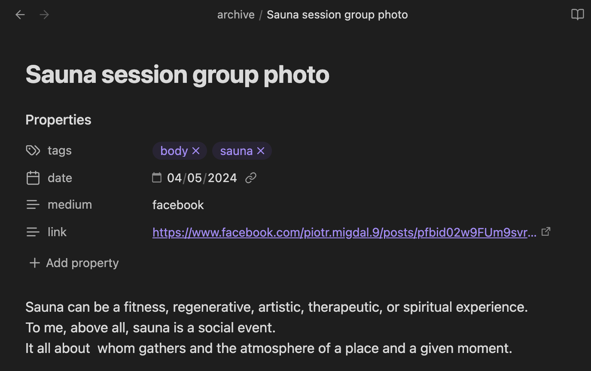

One of Stanisław Lem's stories, [The Memoirs Found in a Bathtub](https://en.wikipedia.org/wiki/Memoirs_Found_in_a_Bathtub), begins with a strange phenomenon that turns all written materials into dust. While this is science fiction, something similar happens in our digital world.

## Digital memento mori

If you publish something online, sooner or later, it will vanish.[^link-rot]

In the best-case scenario, a link changes during website restructuring. More commonly, the content is lost. The only hope is that someone saved it from oblivion in the [Internet Archive Wayback Machine](https://web.archive.org/).

Walled gardens requiring login are even worse - when they go down, everything within them vanishes forever. If you haven't saved it yourself, it's gone. Moreover, any service (free or paid) may restrict access to content at any time - either completely or practically, by making it impossible to find what you're looking for. The same content you posted on Twitter a few years ago, now is on X, and in a few years might be available after login, paid subscription, or - not at all .

Even self-hosting isn't foolproof. Your content can disappear when you forget to pay for hosting or domain - or after a server failure in your basement.

Even if your data exists, accessing it can be tricky. Take WordPress blogs - while your posts are in a database, server updates can break everything. Sure, migration is possible, but it's a hassle.

I learned this lesson with my old PHP photo gallery. When it went down, I was grateful that I had kept all photos as simple JPGs, organized by date. No fancy database needed.

The only reliable solution is to store content in formats that can be opened without specialized software - formats that will remain accessible for decades to come.

::gallery{ width=1 }

#caption
Galadriel in "the Lord of the Rings" opening scene ([video](https://www.youtube.com/watch?v=qj139dE7tFI), [transcript](https://www.tk421.net/lotr/film/fotr/01.html)).
::

## Why things are worth saving

There are many motivations for preserving content, ranging from a digital _"non omnis moriar"_ through practical arguments, to archiving as a goal in itself[^pinboard].

For me, the key reasons are:

- I want to keep and own things I wrote - they are parts of me, my history, my lived experience
- I want to have everything in one place and easily searchable
- I want to use it with AI tools (looking for similar notes, summarizing, using as context)
- I want to be able to reuse or share things however I want (email, blog post, ebook, anything)

## Plaintext

> As a data scientist, [I turn things into vectors](https://p.migdal.pl/blog/2025/01/dont-use-cosine-similarity).  
> As an unabashed archivist, I turn things into Markdown.

The most durable solution would be carving things in stone - it would last for millennia. But that's hardly practical, and it wouldn't make things easily searchable or shareable.

The second best option is plaintext files with UTF-8 encoding and Markdown formatting[^plaintext].

Markdown files are essentially plaintext with some extra syntax for common elements like sections, bullet points, or links. It deliberately doesn't provide precise control over display details like font selection[^html]. Following [the rule of least power](https://en.wikipedia.org/wiki/Rule_of_least_power), I consider this limitation a feature. And as long as computers exist, we'll be able to read plaintext files.

For personal notes, I use [Obsidian](https://obsidian.md/), a note-taking app I love and use daily. While it's a powerful tool with great plugins, what keeps me loyal is its simplicity - it stores everything in plain files. The lack of a proprietary format moat is precisely what makes it so compelling.

For blogging, most [static site generators](https://jamstack.org/generators/) embrace Markdown. This very blog post is written in Markdown[^blog].

## How I do it

I dream of automatically converting everything I write or encounter into Markdown. The reality is messier - there's a constant tension between my autistic urge to archive everything and my ADHD that makes maintaining such systems challenging.

So I take a pragmatic approach - when I find content worth keeping, I copy it to a markdown file, adding frontmatter with its publication date, source, and relevant tags:

I particularly save things I post that might be useful later. Conference talk abstracts, sauna event descriptions, technical explanations - in the future, they're much easier to find and reuse.

When I catch myself searching for old content (like a Facebook post I want to share or reread), I save it immediately. If I discover a blog post has vanished, I retrieve it from the Wayback Machine and preserve it. When forwarding an email with a detailed explanation - you guessed it, I save it.

**Content worth searching for once is content worth preserving forever.**

Worried about saving too much? Well, disk storage is cheap - and for text files, it's practically free.

## Tools that help

Sometimes manual copying suffices. For trickier formatting, AI tools are invaluable - being trained on Markdown, they excel at processing and extracting content. You can use them to convert online text or parse PDFs (like slides), as shown in [Ingesting Millions of PDFs and why Gemini 2.0 Changes Everything](https://www.sergey.fyi/articles/gemini-flash-2).

For some sources, I've created semi-automated solutions. For instance, I wrote a [Python script](https://gist.github.com/stared/ce732ef27d97d559b34d7e294481f1b0) to convert my Kindle highlights and notes into Markdown.

Many tools exist to help with format conversion. The most versatile is [pandoc](https://github.com/jgm/pandoc), which can convert between dozens of formats - from Word documents to LaTeX, and everything in between.

The community has also created specialized tools for specific platforms. You can find tools for converting [Medium posts to Markdown](https://github.com/gautamdhameja/medium-2-md) (either from export or [directly by URL](https://medium2md.nabilmansour.com/)), [archiving Reddit threads](https://farnots.github.io/RedditToMarkdown/), and many other use cases.

Since we're dealing with lightweight text files, there are many for backing it up. Git is particularly well-suited for version-controlling and syncing this content.

Additionally, in each service I own, I periodically download my data. Even if it's a mesh of JSON, XML, HTML, CSV and other formats, I have it. Even if at a given moment I have no time to process it into Markdown, at least the data is there.

## Next steps

I would love to have a comprehensive tool for exporting everything - especially from social media. Both the posts that resonated with many people and those that hold personal significance deserve preservation.

While Facebook offers limited data export capabilities, they're incomplete. Most notably, there's no way to preserve entire discussion threads - often the most valuable part of a post.

And you - what content do you find yourself searching for? What have you archived, and what do you wish you had saved?

[^link-rot]: [Link rot](https://en.wikipedia.org/wiki/Link_rot) can be addressed using services like [Perma.cc](https://perma.cc/) - though they too could eventually disappear. Studies show that for legal documents, half of links die within 5 years. My focus here is on preserving and searching personal content.
[^pinboard]: But for practical reasons, and hoarding for its own sake, I fathered over 14k links in [Pinboard](https://pinboard.in/). Yes, downloaded data in JSON.
[^plaintext]: I don't claim Markdown is the only solution. There are valid reasons to use other formats. My focus is on plaintext in UTF-8. If you prefer other markup languages (like reStructuredText, AsciiDoc, Org-Mode) or just plain text without formatting - the principles still apply. In some cases original format works - e.g. if it is JSON or code.
[^html]: Consider HTML (Hypertext Markup Language) as a counterexample. It was meant to enrich text with semantics, but now serves primarily as a tool for building UIs. While this evolution brought many benefits, HTML is no longer suitable for pure content storage.
[^blog]: This blog uses [Nuxt 3 Content](https://content.nuxt.com/) (source: [github.com/stared/stared.github.io](https://github.com/stared/stared.github.io)). It follows my previous versions in [Jekyll](https://jekyllrb.com/) and [Gridsome](https://gridsome.org/). Thanks to Markdown, migration between platforms has been seamless - see [New blog - moving from Medium to Gridsome](https://p.migdal.pl/blog/2022/12/medium-to-markdown). For the latest migration from Gridsome to Nuxt 3 Content, [Cursor IDE](https://www.cursor.com/) was a great help. [Astro](https://astro.build/) is another static site generator gaining significant traction.
